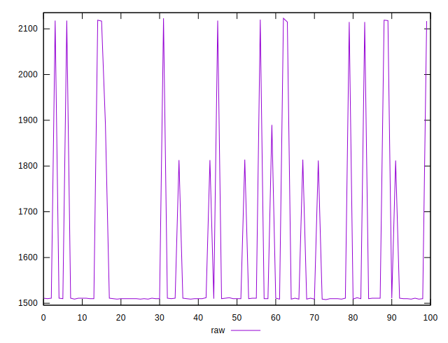
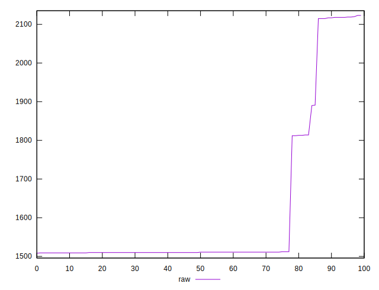
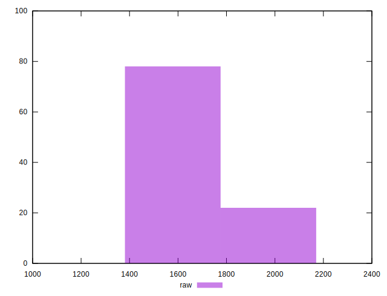

# //metrics/samples/pages+cached+noexternal+nofonts+nosvg+noimg

[→ Parent](../..)


## Raw


```yaml
p90min: 1508
p90max: 2117
p90range: 609
p90mean: 1565.7222222222222
p90median: 1510
p90stdev: 150.0944908144183
p90skewness: 2.663487309196003
p90eccentricity: 1.0000000000000002
p90discretization: 7.5
outlandishness: 1.071962182809475

```

