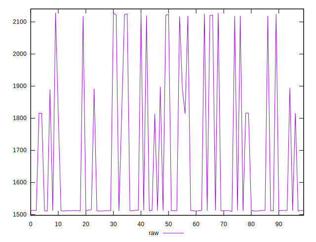
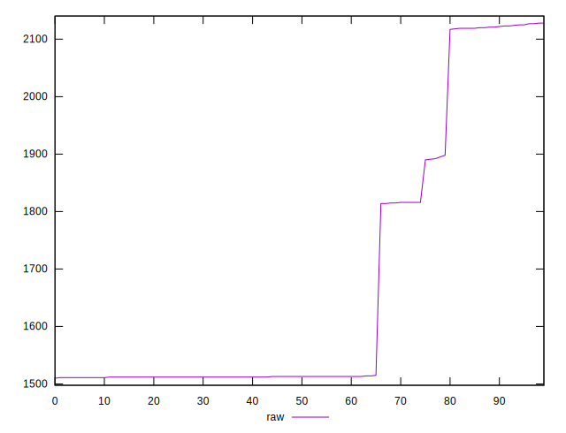
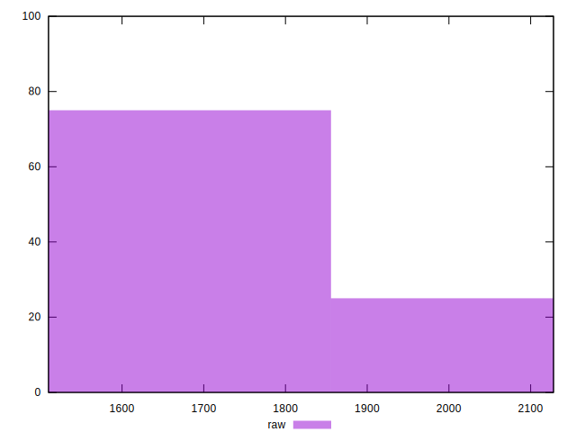

# //metrics/samples/pages+cached+noexternal+nofonts

[→ Parent](../..)


## Raw


```yaml
p90min: 1510
p90max: 2121
p90range: 611
p90mean: 1631.1444444444444
p90median: 1513
p90stdev: 209.90281143165626
p90skewness: 1.4399083830735113
p90eccentricity: 1.0000000000000029
p90discretization: 4.7368421052631575
outlandishness: 1.0614951979990082

```

