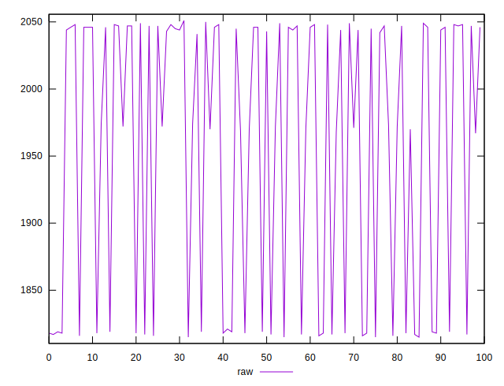
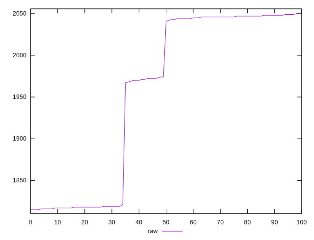
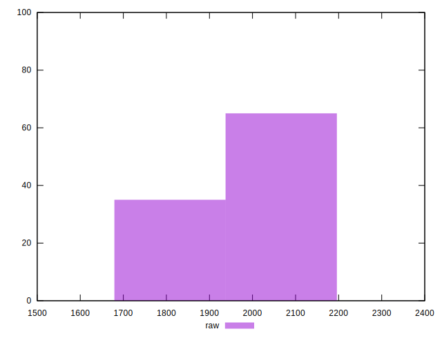

# //metrics/samples/pages+cached+noexternal+noimg

[→ Parent](../..)


## Raw


```yaml
p90min: 1815
p90max: 2048
p90range: 233
p90mean: 1944.4888888888888
p90median: 1972
p90stdev: 104.63282302566908
p90skewness: -0.29084746170724696
p90eccentricity: 1.0000000000000013
p90discretization: 4.090909090909091
outlandishness: 1.0107680156178238

```

