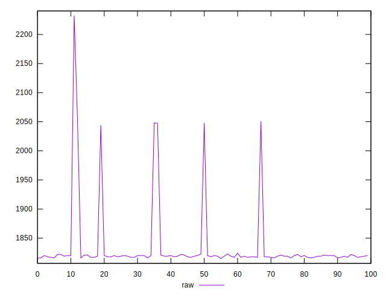
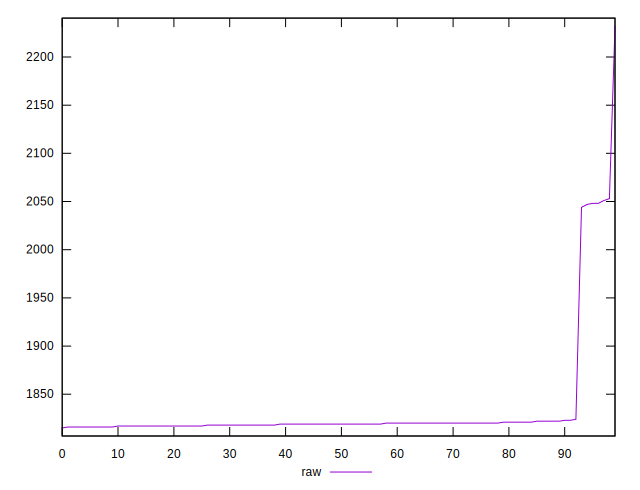
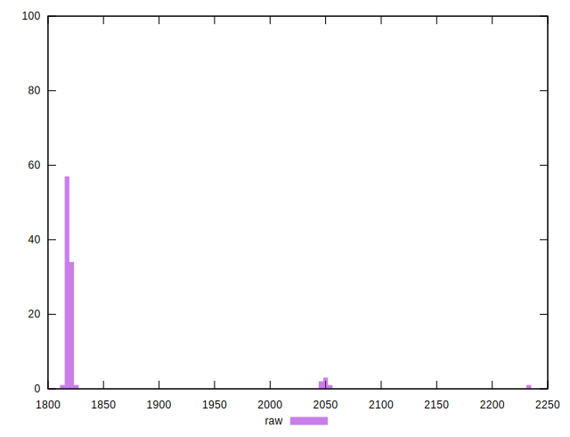

# //metrics/samples/pages+cached+noexternal+nosvg

[→ Parent](../..)


## Raw


```yaml
p90min: 1815
p90max: 1822
p90range: 7
p90mean: 1818.6888888888889
p90median: 1819
p90stdev: 1.6842040285774582
p90skewness: -0.007024506751000222
p90eccentricity: 1.0000000000000013
p90discretization: 11.25
outlandishness: 1.0199603046326053

```

