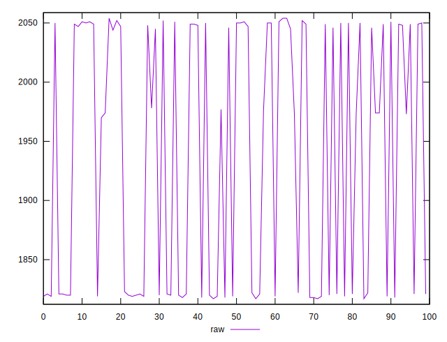
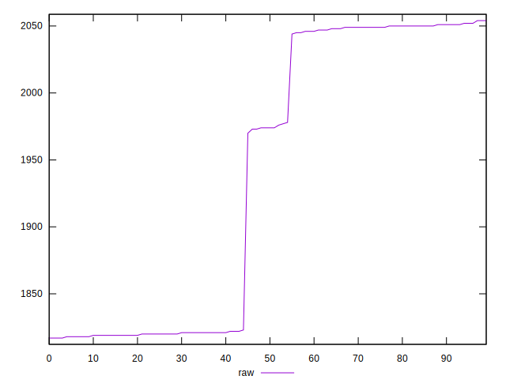
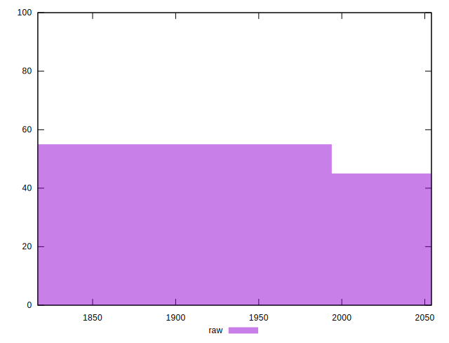

# //metrics/samples/pages+cached+noexternal

[→ Parent](../..)


## Raw


```yaml
p90min: 1818
p90max: 2054
p90range: 236
p90mean: 1950.4505494505495
p90median: 1978
p90stdev: 107.77512850316592
p90skewness: -0.3145483795424247
p90eccentricity: 1.0000000000000004
p90discretization: 4.136363636363637
outlandishness: 0.987773207350794

```

