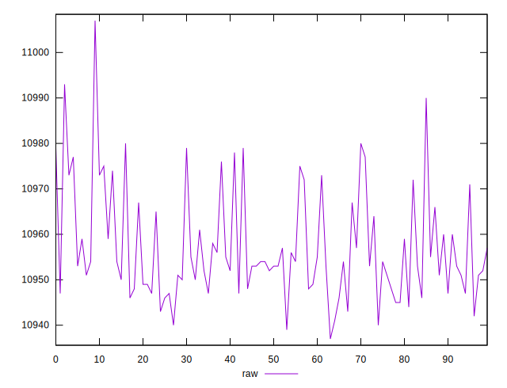
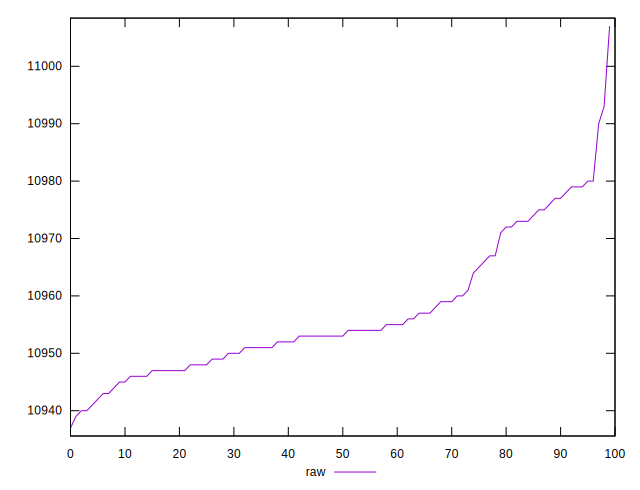
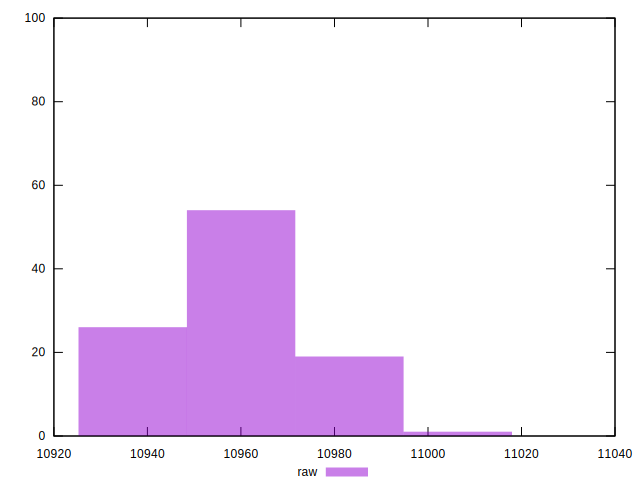

# //metrics/samples/pages+cached+nointeractive

[→ Parent](../..)


## Raw


```yaml
p90min: 10937
p90max: 10977
p90range: 40
p90mean: 10954.57142857143
p90median: 10953
p90stdev: 9.62841816814798
p90skewness: 0.8007429328267128
p90eccentricity: 1.0000000000000002
p90discretization: 2.6
outlandishness: 1.0005000494558693

```

