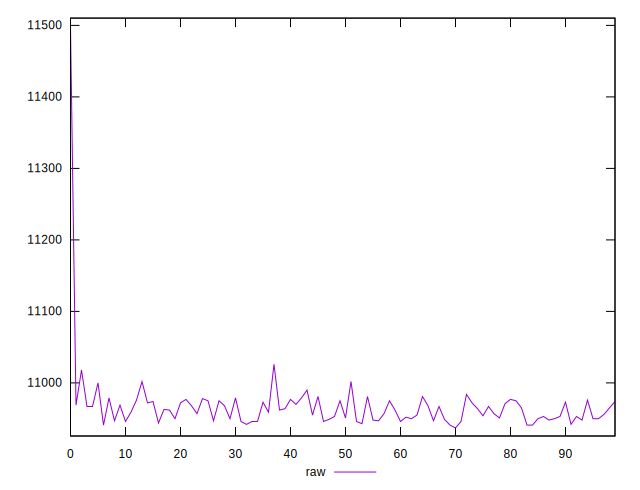
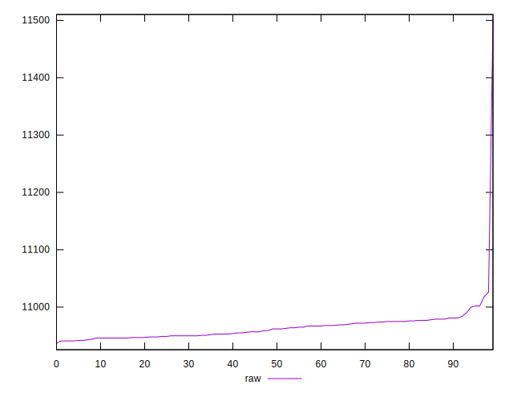
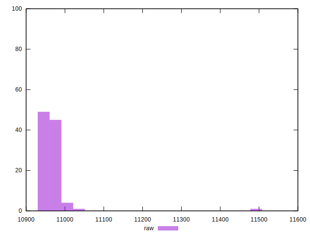

# //metrics/samples/pages+cached

[→ Parent](../..)


## Raw


```yaml
p90min: 10941
p90max: 10990
p90range: 49
p90mean: 10960.813186813188
p90median: 10959
p90stdev: 12.74079032854203
p90skewness: 0.19657482020863312
p90eccentricity: 0.9999999999999997
p90discretization: 2.4594594594594597
outlandishness: 1.0013117948820096

```

