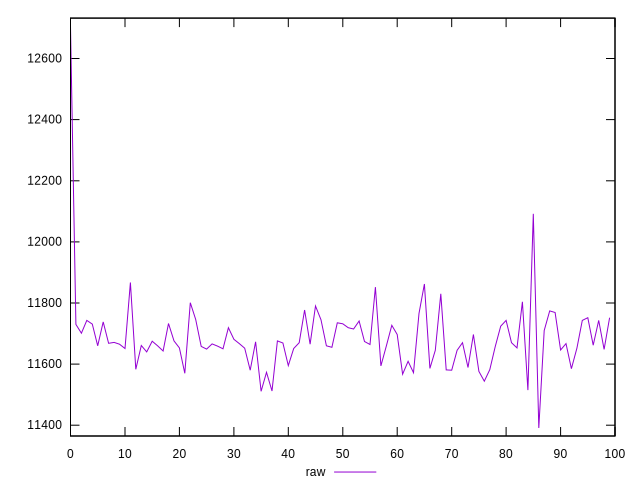
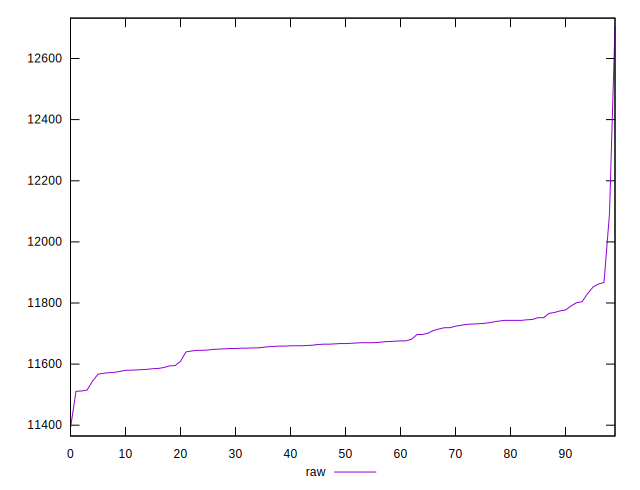
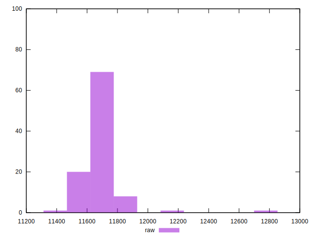

# //metrics/samples/pages

[→ Parent](../..)


## Raw


```yaml
p90min: 11391
p90max: 11774
p90range: 383
p90mean: 11659.511111111111
p90median: 11663
p90stdev: 67.68361765424062
p90skewness: -0.8751692409978602
p90eccentricity: 1.0000000000000002
p90discretization: 1.267605633802817
outlandishness: 1.004784449574795

```

