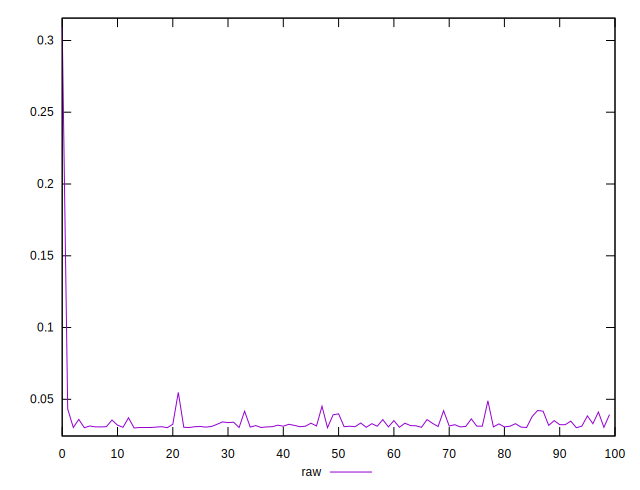
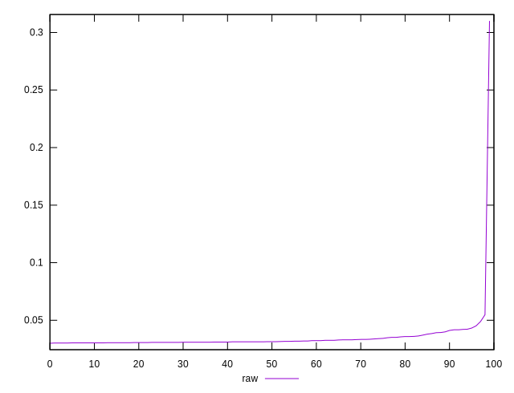
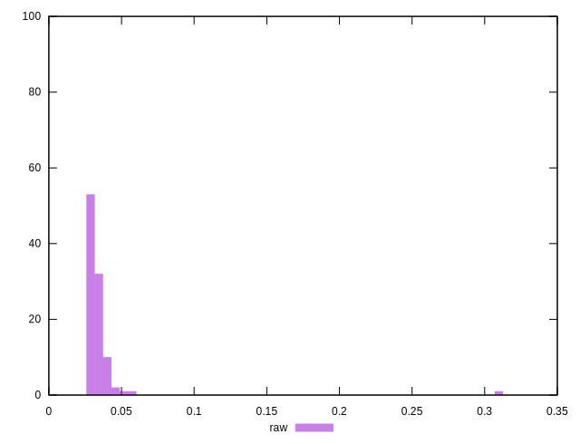

# //network-rtt/samples/empty

[→ Parent](../..)


## Raw


```yaml
p90min: 0.03
p90max: 0.0399
p90range: 0.009899999999999999
p90mean: 0.032194999999999974
p90median: 0.0312
p90stdev: 0.0023234080571436434
p90skewness: 1.6375002699221246
p90eccentricity: 0.9999999999999999
p90discretization: 2.5
outlandishness: 1.2560425314359613

```

