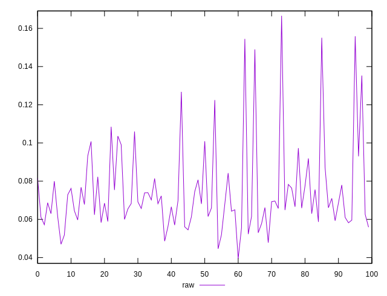
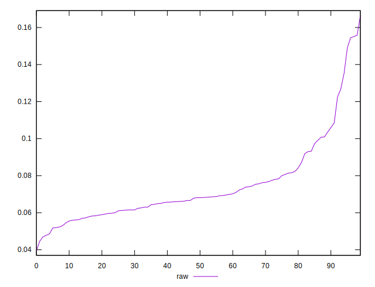

# //network-rtt/samples/pages+cached+noadtech

[→ Parent](../..)


## Raw


```yaml
p90min: 0.0395
p90max: 0.1036
p90range: 0.06409999999999999
p90mean: 0.06817777777777778
p90median: 0.06615
p90stdev: 0.012982533375251
p90skewness: 0.7112021462409214
p90eccentricity: 1.0000000000000002
p90discretization: 1.0588235294117647
outlandishness: 1.2153768857759526

```

