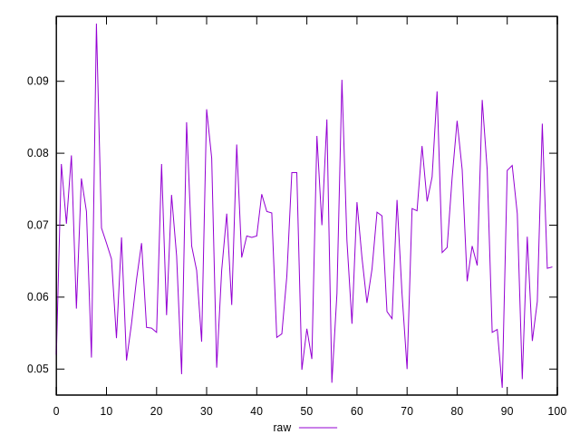
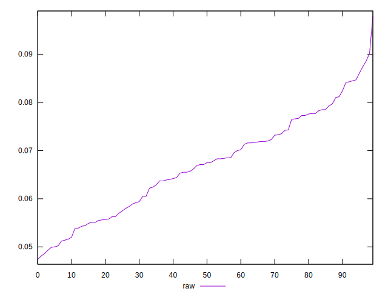
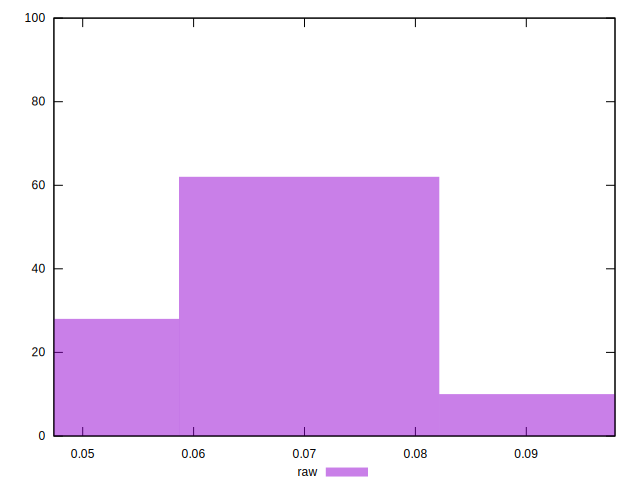

# //network-rtt/samples/pages+cached+noexternal+nocss

[→ Parent](../..)


## Raw


```yaml
p90min: 0.0499
p90max: 0.0847
p90range: 0.0348
p90mean: 0.06666263736263739
p90median: 0.0671
p90stdev: 0.009514888834234207
p90skewness: 0.013219260481566367
p90eccentricity: 0.9999999999999999
p90discretization: 1.1666666666666667
outlandishness: 1.0131647167592361

```

