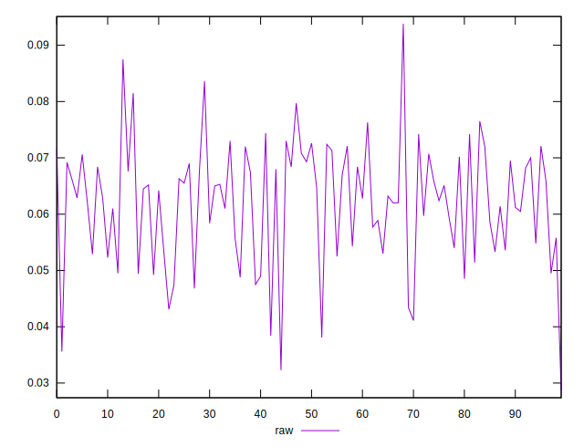
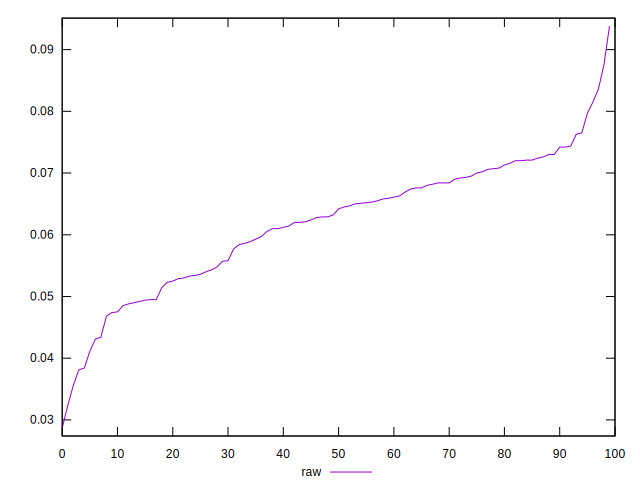
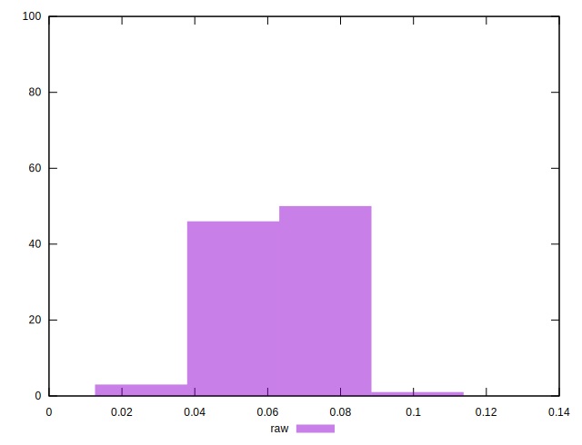

# //network-rtt/samples/pages+cached+noexternal+nofonts+nosvg+noimg+nocss+nojs

[→ Parent](../..)


## Raw


```yaml
p90min: 0.028699999999999996
p90max: 0.073
p90range: 0.0443
p90mean: 0.059857777777777794
p90median: 0.06225
p90stdev: 0.010235471847971507
p90skewness: -0.8759913668399806
p90eccentricity: 0.9999999999999997
p90discretization: 1.125
outlandishness: 1.0690198062383183

```

