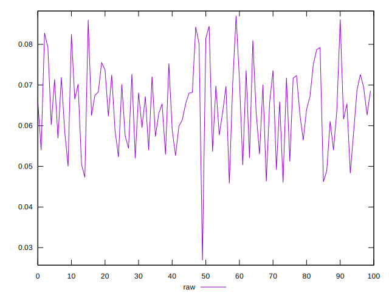
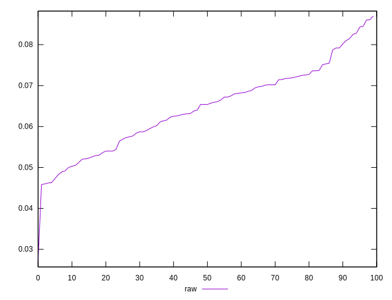
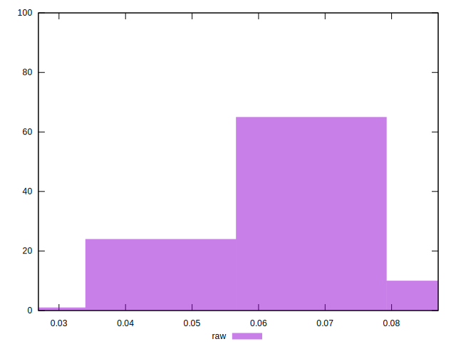

# //network-rtt/samples/pages+cached+noexternal+nofonts+nosvg+noimg+nocss

[→ Parent](../..)


## Raw


```yaml
p90min: 0.0462
p90max: 0.08249999999999999
p90range: 0.03629999999999999
p90mean: 0.06391428571428572
p90median: 0.0654
p90stdev: 0.009178337748767761
p90skewness: -0.0788754213028801
p90eccentricity: 1.0000000000000002
p90discretization: 1.123456790123457
outlandishness: 1.017023110450506

```

