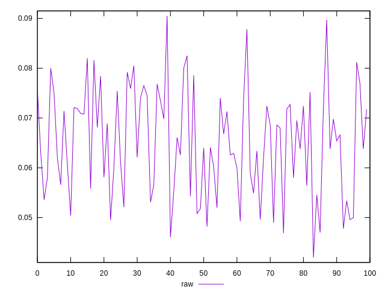
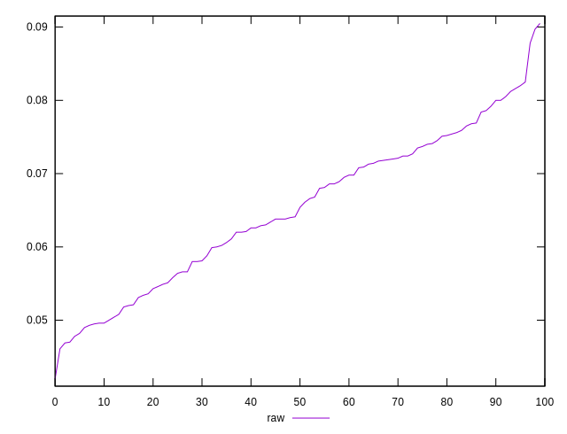
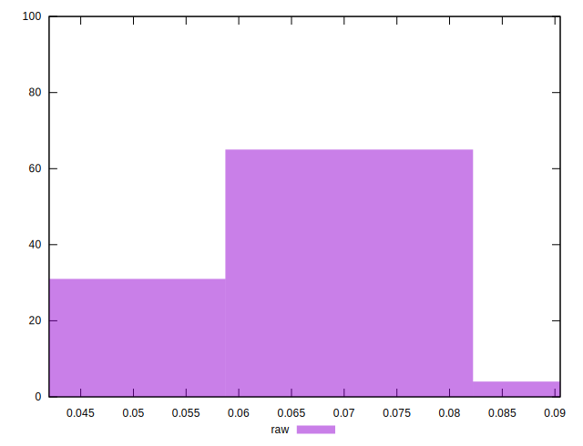

# //network-rtt/samples/pages+cached+noexternal+nofonts+nosvg+noimg

[→ Parent](../..)


## Raw


```yaml
p90min: 0.041999999999999996
p90max: 0.07919999999999999
p90range: 0.0372
p90mean: 0.06313666666666667
p90median: 0.06359999999999999
p90stdev: 0.009581283258984094
p90skewness: -0.20215711432944808
p90eccentricity: 0.9999999999999993
p90discretization: 1.1111111111111112
outlandishness: 1.0658074200836503

```

