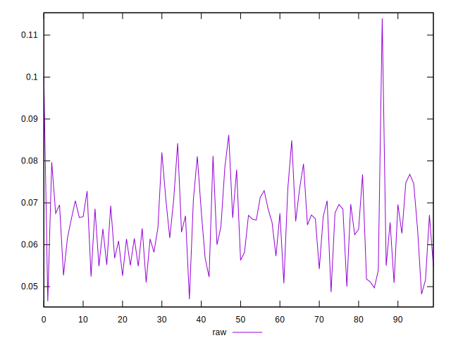
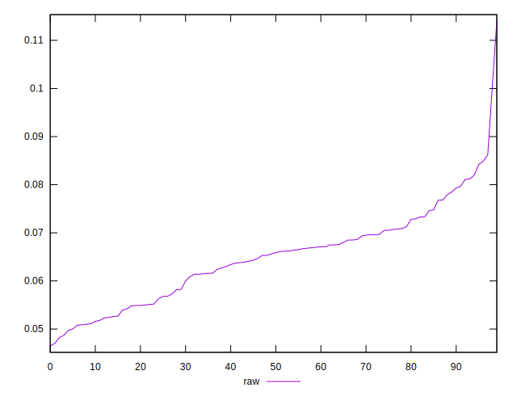
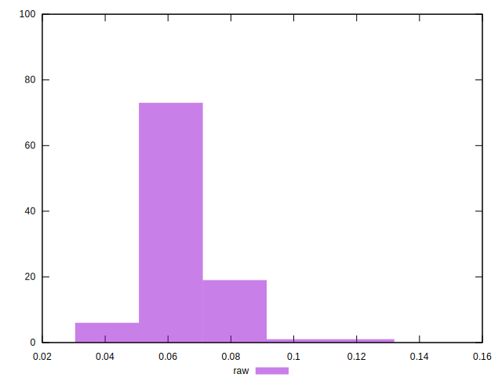

# //network-rtt/samples/pages+cached+noexternal+nofonts

[→ Parent](../..)


## Raw


```yaml
p90min: 0.0487
p90max: 0.0812
p90range: 0.032499999999999994
p90mean: 0.06404725274725276
p90median: 0.0653
p90stdev: 0.008229461155758669
p90skewness: -0.01811243361699141
p90eccentricity: 1.0000000000000002
p90discretization: 1.1666666666666667
outlandishness: 1.036829402372917

```

