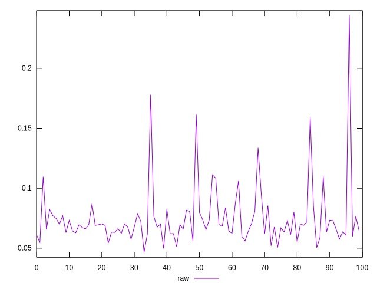
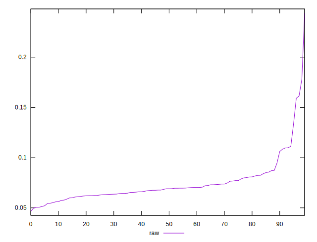
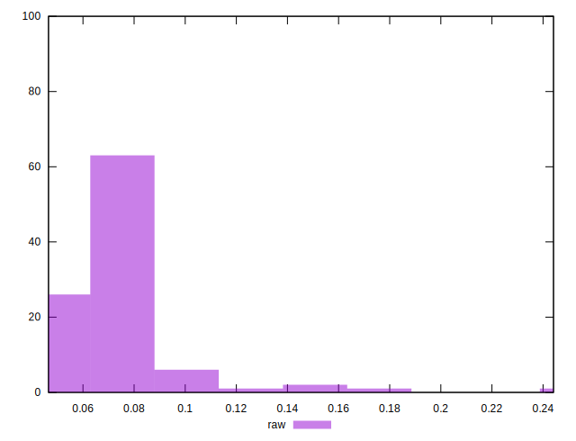

# //network-rtt/samples/pages+cached+noexternal+noimg

[→ Parent](../..)


## Raw


```yaml
p90min: 0.0465
p90max: 0.10609999999999999
p90range: 0.059599999999999986
p90mean: 0.06829230769230771
p90median: 0.0675
p90stdev: 0.010188479065275995
p90skewness: 0.6517058758958649
p90eccentricity: 1
p90discretization: 1.1818181818181819
outlandishness: 1.2157558713975187

```

