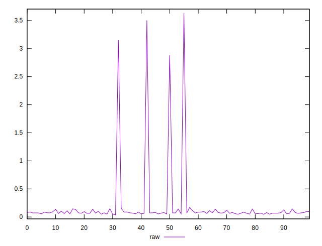
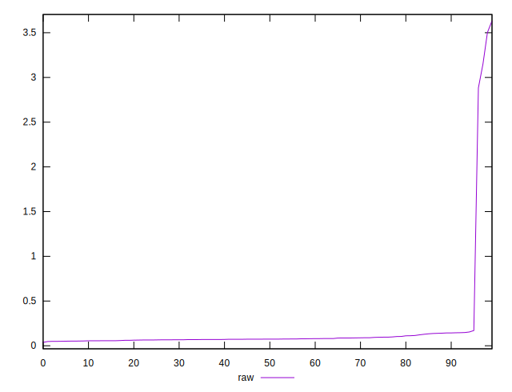
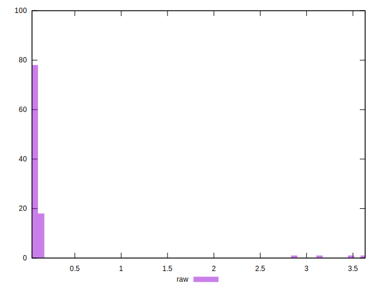

# //network-rtt/samples/pages+cached+noexternal+nojs

[→ Parent](../..)


## Raw


```yaml
p90min: 0.0382
p90max: 0.1431
p90range: 0.10490000000000001
p90mean: 0.07764555555555556
p90median: 0.0733
p90stdev: 0.022460509349676683
p90skewness: 1.2028636970112494
p90eccentricity: 0.9999999999999999
p90discretization: 1.0588235294117647
outlandishness: 7.358105551910631

```

