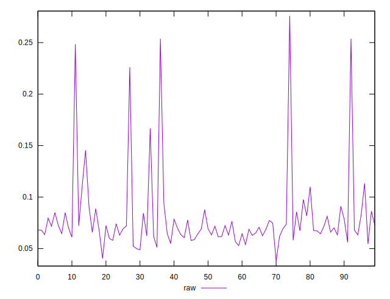
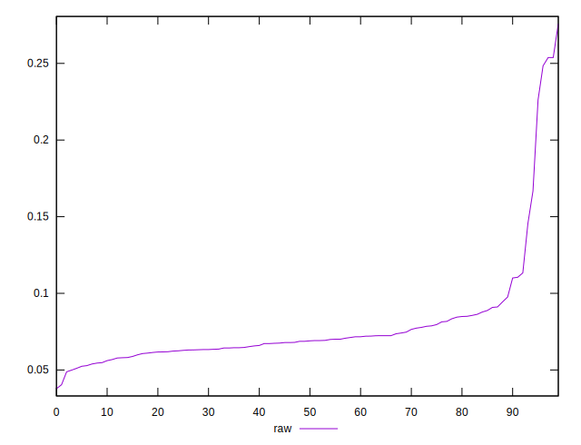
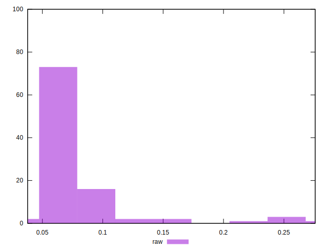

# //network-rtt/samples/pages+cached+noexternal+nosvg

[→ Parent](../..)


## Raw


```yaml
p90min: 0.048799999999999996
p90max: 0.11329999999999998
p90range: 0.06449999999999999
p90mean: 0.07039780219780219
p90median: 0.068
p90stdev: 0.012782542851994361
p90skewness: 1.1556525115114147
p90eccentricity: 0.9999999999999997
p90discretization: 1.1375
outlandishness: 1.3091557610419982

```

