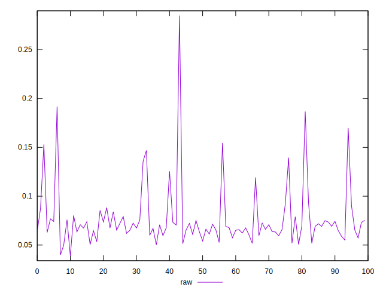
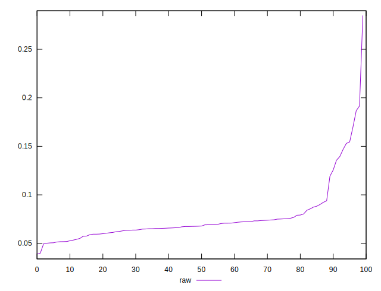
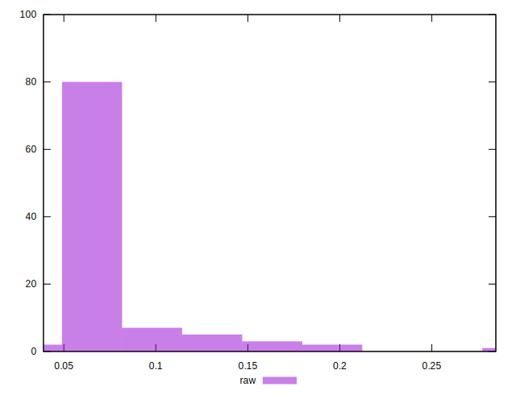

# //network-rtt/samples/pages+cached+noexternal

[→ Parent](../..)


## Raw


```yaml
p90min: 0.038900000000000004
p90max: 0.1256
p90range: 0.08669999999999999
p90mean: 0.06810219780219781
p90median: 0.0674
p90stdev: 0.013231580421264528
p90skewness: 1.3834132023717798
p90eccentricity: 0.9999999999999997
p90discretization: 1.1097560975609757
outlandishness: 1.2983446532554488

```

