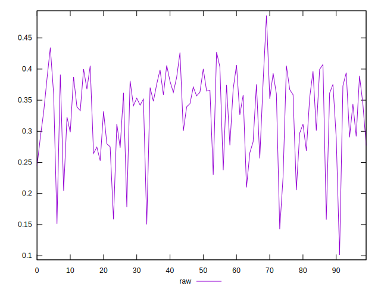
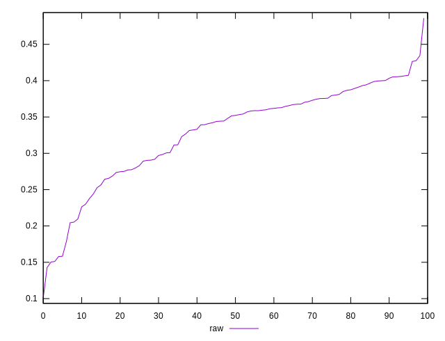
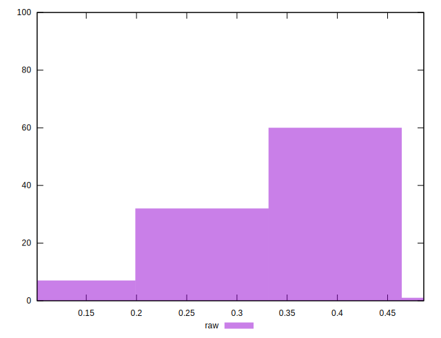

# //network-rtt/samples/pages+cached+nointeractive

[→ Parent](../..)


## Raw


```yaml
p90min: 0.2054
p90max: 0.43460000000000004
p90range: 0.22920000000000004
p90mean: 0.34086481390514245
p90median: 0.3569
p90stdev: 0.053745448663839214
p90skewness: -0.6149311751497925
p90eccentricity: 1.0000000000000004
p90discretization: 1.011111111111111
outlandishness: 0.9230750096127318

```

