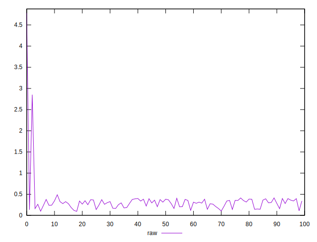
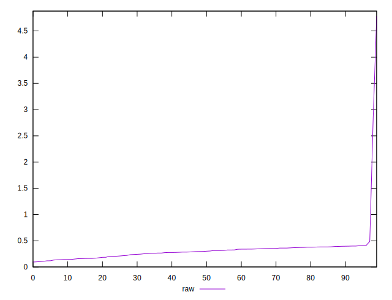
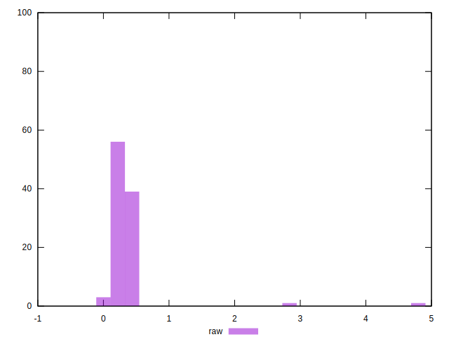

# //network-rtt/samples/pages+cached

[→ Parent](../..)


## Raw


```yaml
p90min: 0.13939999999999997
p90max: 0.4899
p90range: 0.35050000000000003
p90mean: 0.29877802197802183
p90median: 0.3142
p90stdev: 0.08317309740746204
p90skewness: -0.36232471376223585
p90eccentricity: 0.9999999999999997
p90discretization: 1.011111111111111
outlandishness: 1.420725148334466

```

