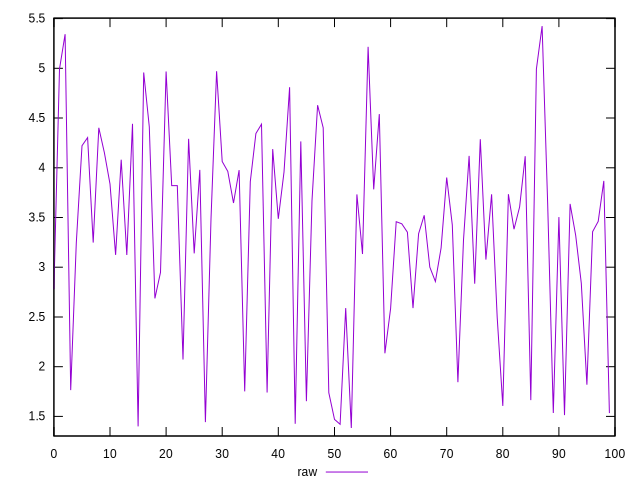
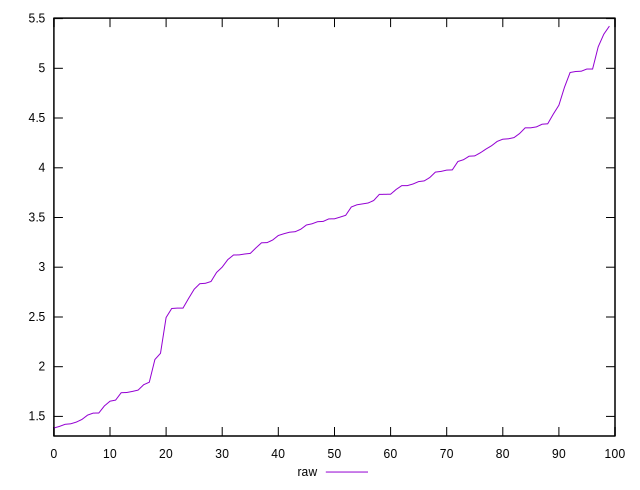
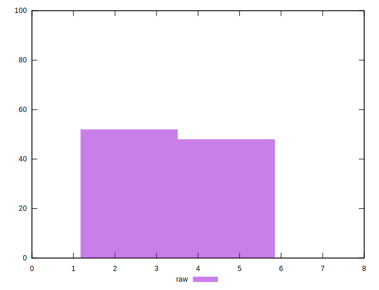

# //network-rtt/samples/pages

[→ Parent](../..)


## Raw


```yaml
p90min: 1.384
p90max: 4.54
p90range: 3.156
p90mean: 3.1713666666666653
p90median: 3.4034999999999993
p90stdev: 0.9480438157947482
p90skewness: -0.585496818720396
p90eccentricity: 1.0000000000000002
p90discretization: 1
outlandishness: 1.1206815246808208

```

