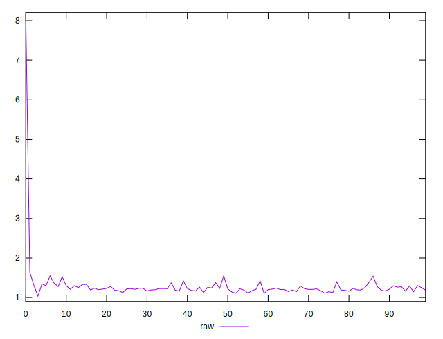
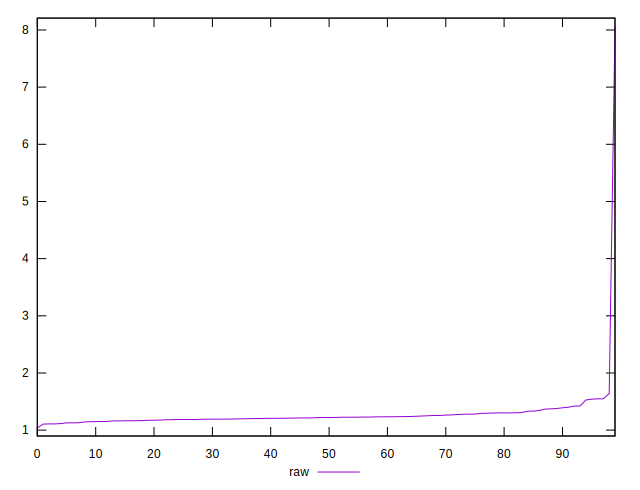
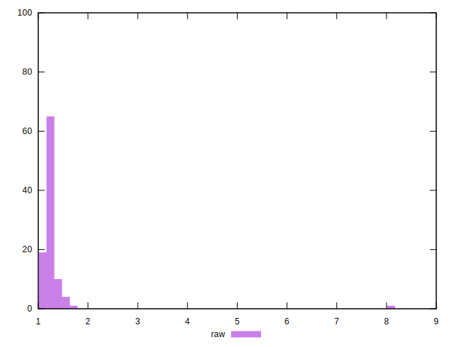

# //network-server-latency/samples/empty

[→ Parent](../..)


## Raw


```yaml
p90min: 1.1098000000000001
p90max: 1.42215
p90range: 0.3123499999999999
p90mean: 1.2298532967032962
p90median: 1.21895
p90stdev: 0.06906393351242507
p90skewness: 0.879535724368339
p90eccentricity: 1
p90discretization: 1.011111111111111
outlandishness: 1.135341040889922

```

