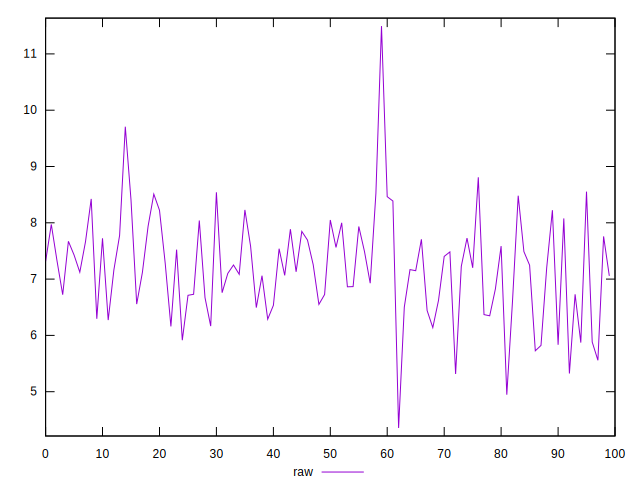
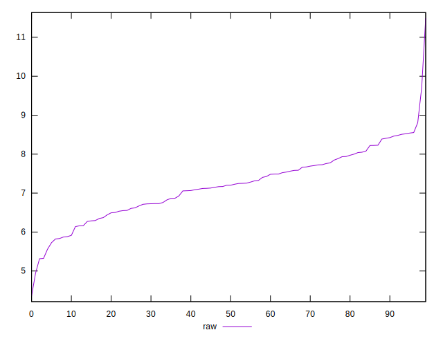
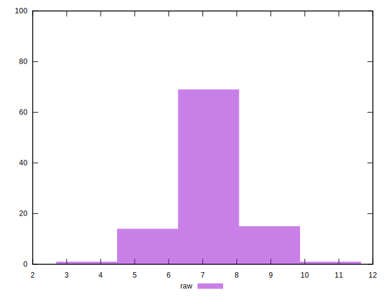

# //network-server-latency/samples/pages+cached+noadtech

[→ Parent](../..)


## Raw


```yaml
p90min: 5.8227
p90max: 8.554099999999998
p90range: 2.731399999999998
p90mean: 7.245351648351647
p90median: 7.2284
p90stdev: 0.7266133339010353
p90skewness: -0.022726990591052383
p90eccentricity: 1.0000000000000002
p90discretization: 1
outlandishness: 0.9890719187802308

```

