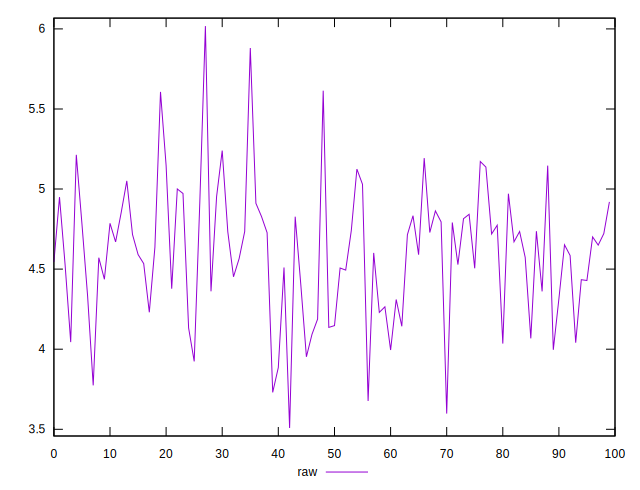
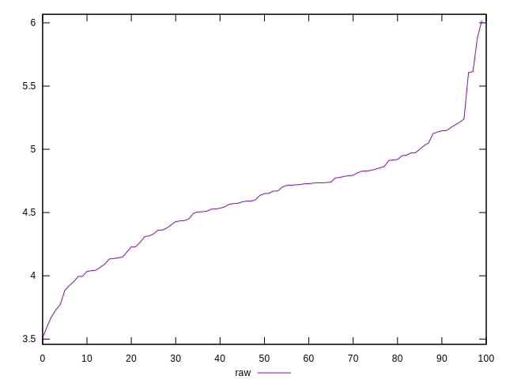
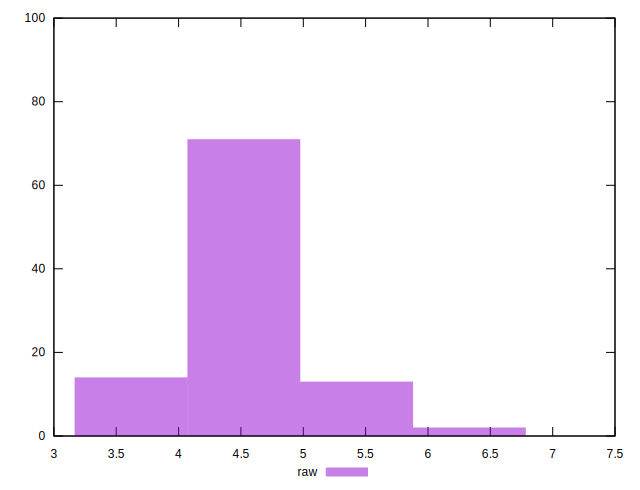

# //network-server-latency/samples/pages+cached+noexternal+nocss

[→ Parent](../..)


## Raw


```yaml
p90min: 3.885
p90max: 5.24
p90range: 1.3550000000000004
p90mean: 4.601760439560439
p90median: 4.6497
p90stdev: 0.33769983514173024
p90skewness: -0.2282479089607221
p90eccentricity: 1
p90discretization: 1
outlandishness: 0.999949828717075

```

