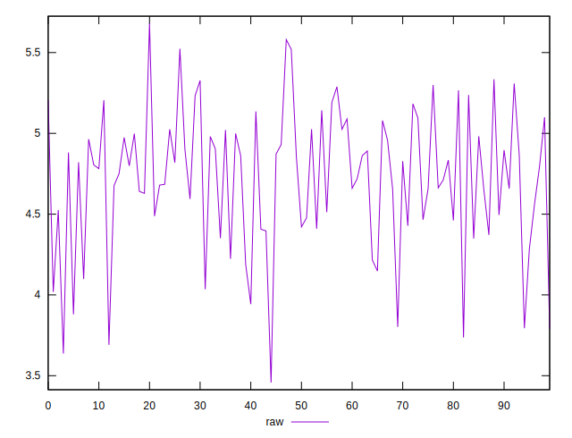
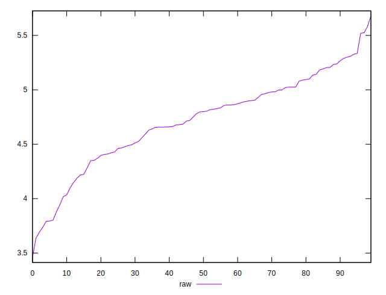
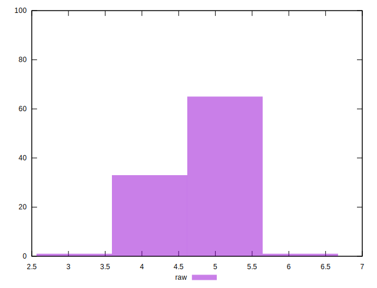

# //network-server-latency/samples/pages+cached+noexternal+nofonts+nosvg+noimg+nocss+nojs

[→ Parent](../..)


## Raw


```yaml
p90min: 3.4577
p90max: 5.2373
p90range: 1.7796000000000003
p90mean: 4.63488
p90median: 4.69875
p90stdev: 0.4155889799629758
p90skewness: -0.8278749157489553
p90eccentricity: 0.9999999999999997
p90discretization: 1
outlandishness: 1.0338519728009217

```

