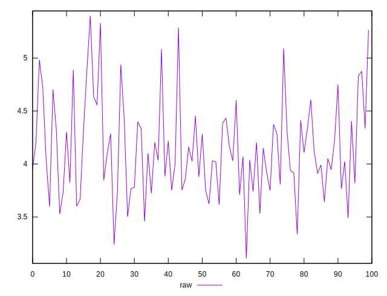
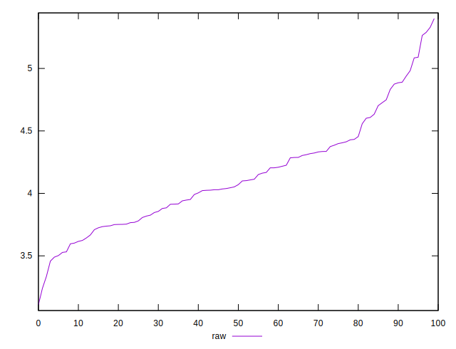
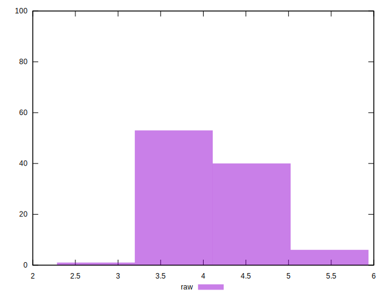

# //network-server-latency/samples/pages+cached+noexternal+nofonts+nosvg+noimg+nocss

[→ Parent](../..)


## Raw


```yaml
p90min: 3.1083
p90max: 4.8746
p90range: 1.7663000000000002
p90mean: 4.038139999999999
p90median: 4.029100000000001
p90stdev: 0.3640986724624093
p90skewness: 0.04959299403131369
p90eccentricity: 1.0000000000000009
p90discretization: 1
outlandishness: 1.0540491564100574

```

