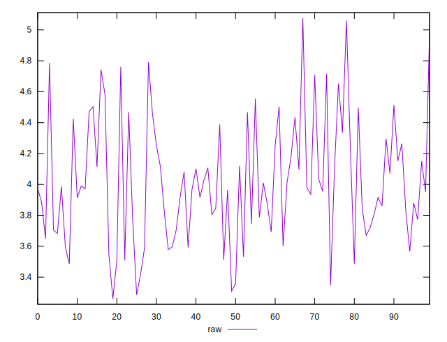
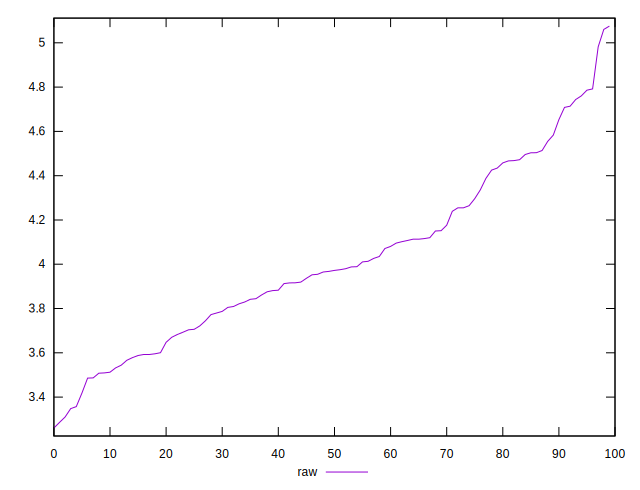
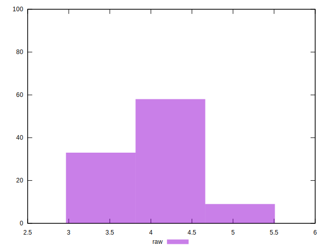

# //network-server-latency/samples/pages+cached+noexternal+nofonts+nosvg+noimg

[→ Parent](../..)


## Raw


```yaml
p90min: 3.2605999999999997
p90max: 4.5834
p90range: 1.3228000000000004
p90mean: 3.9307766666666675
p90median: 3.9279
p90stdev: 0.33348434147814365
p90skewness: 0.09251942456781606
p90eccentricity: 0.9999999999999999
p90discretization: 1
outlandishness: 1.0461529512710737

```

