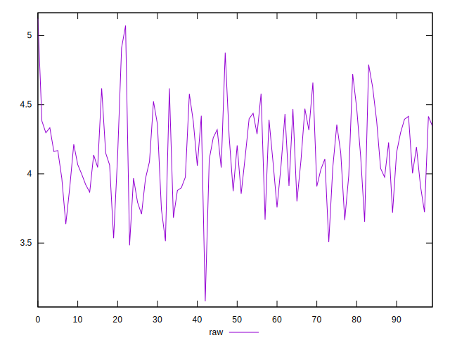
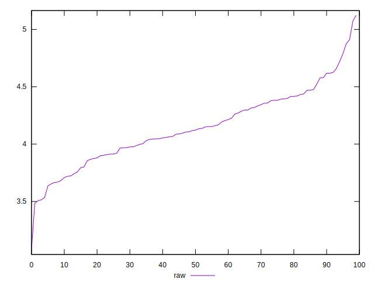
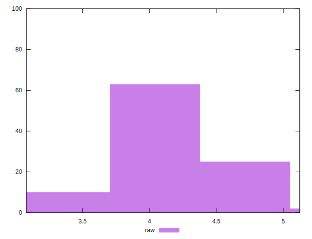

# //network-server-latency/samples/pages+cached+noexternal+nofonts

[→ Parent](../..)


## Raw


```yaml
p90min: 3.5350999999999995
p90max: 4.7216
p90range: 1.1865
p90mean: 4.133870329670328
p90median: 4.118
p90stdev: 0.2730247513211161
p90skewness: 0.00735833352611856
p90eccentricity: 1.0000000000000002
p90discretization: 1
outlandishness: 1.0055718574516286

```

