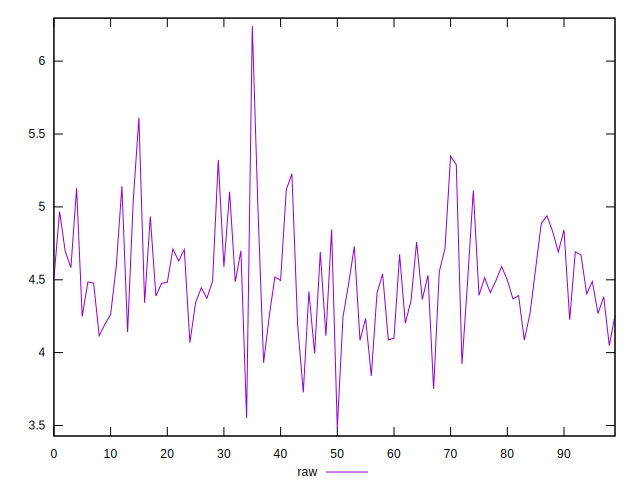
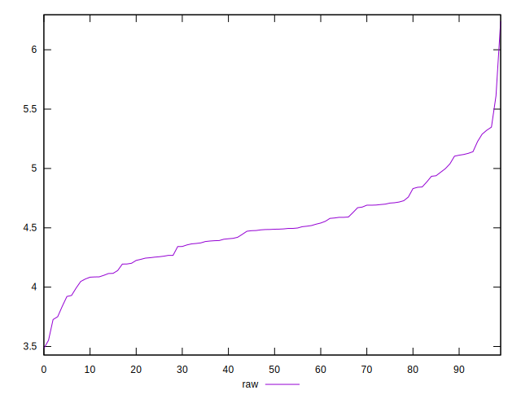
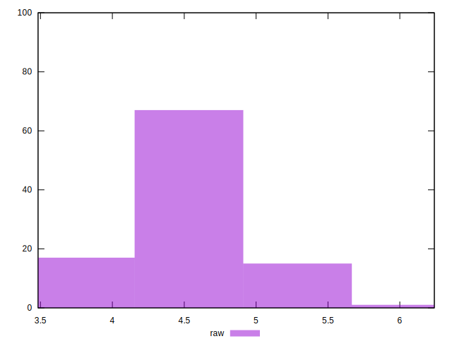

# //network-server-latency/samples/pages+cached+noexternal+noimg

[→ Parent](../..)


## Raw


```yaml
p90min: 3.8400999999999996
p90max: 5.2279
p90range: 1.3878000000000004
p90mean: 4.497479120879118
p90median: 4.4858
p90stdev: 0.30624681976962204
p90skewness: 0.31455338448844605
p90eccentricity: 1
p90discretization: 1
outlandishness: 1.008238338799929

```

