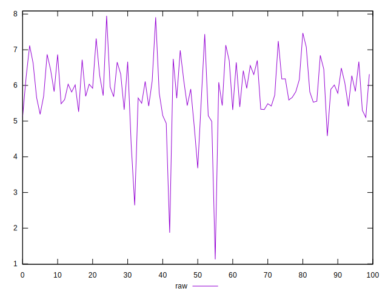
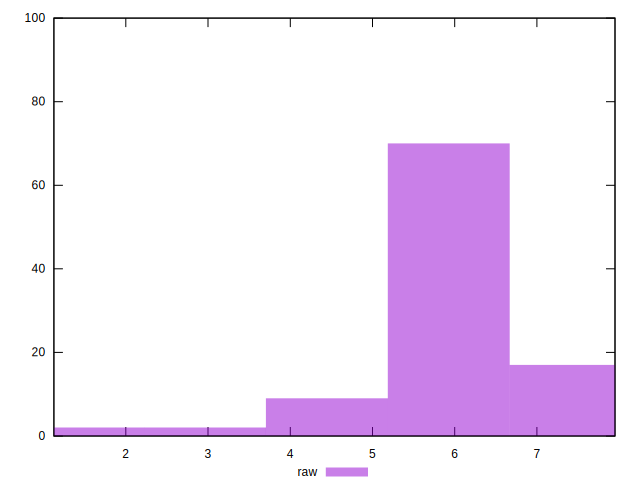

# //network-server-latency/samples/pages+cached+noexternal+nojs

[→ Parent](../..)


## Raw


```yaml
p90min: 1.125
p90max: 6.8712
p90range: 5.7462
p90mean: 5.69802111111111
p90median: 5.80285
p90stdev: 0.9253383738448745
p90skewness: -2.4863806034880684
p90eccentricity: 0.9999999999999996
p90discretization: 1
outlandishness: 1.0593005682269152

```

