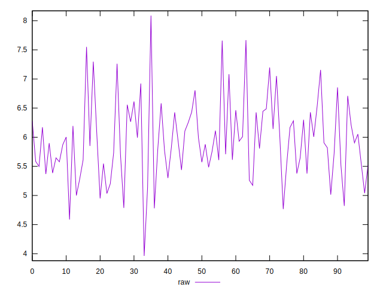
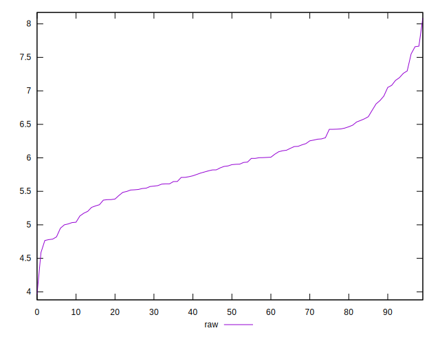
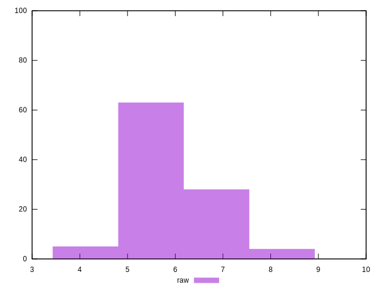

# //network-server-latency/samples/pages+cached+noexternal+nosvg

[→ Parent](../..)


## Raw


```yaml
p90min: 3.9623
p90max: 6.9219
p90range: 2.9596
p90mean: 5.785008888888889
p90median: 5.8124
p90stdev: 0.556082704409344
p90skewness: -0.3944447769298649
p90eccentricity: 0.9999999999999999
p90discretization: 1
outlandishness: 1.0566624072678428

```

