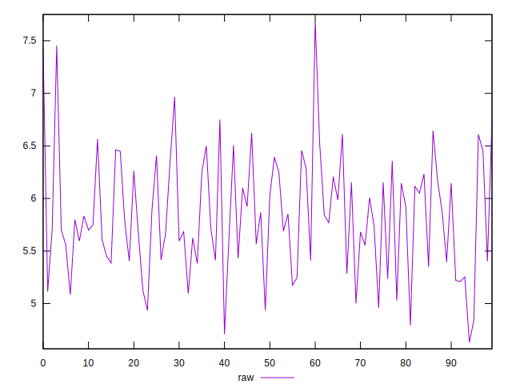
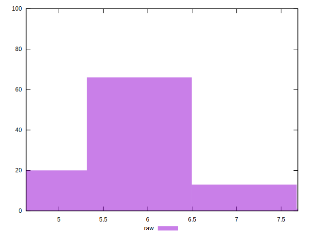

# //network-server-latency/samples/pages+cached+noexternal

[→ Parent](../..)


## Raw


```yaml
p90min: 4.935
p90max: 6.743800000000001
p90range: 1.8088000000000015
p90mean: 5.805910989010988
p90median: 5.7482999999999995
p90stdev: 0.4786520892220197
p90skewness: 0.07177192260125546
p90eccentricity: 0.9999999999999996
p90discretization: 1
outlandishness: 1.0103956246988857

```

