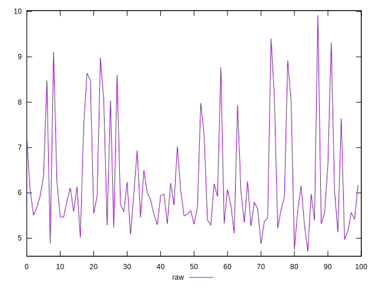
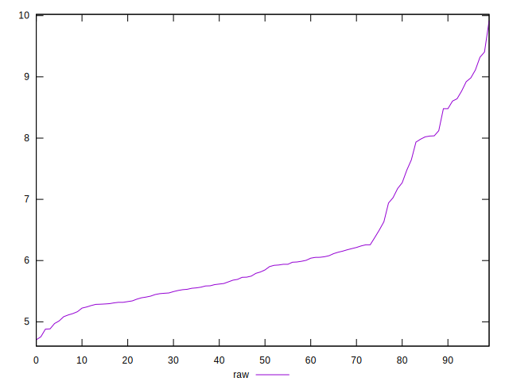
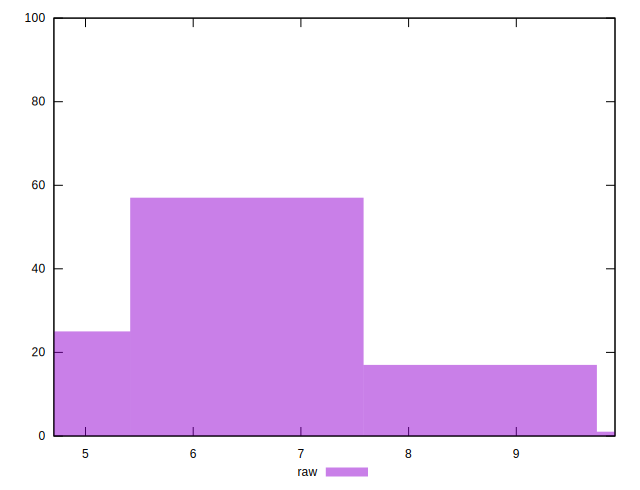

# //network-server-latency/samples/pages+cached+nointeractive

[→ Parent](../..)


## Raw


```yaml
p90min: 4.706955205741551
p90max: 8.4803
p90range: 3.773344794258449
p90mean: 5.937184849217336
p90median: 5.7102
p90stdev: 0.8417639571752381
p90skewness: 1.3438667143363499
p90eccentricity: 0.9999999999999993
p90discretization: 1
outlandishness: 1.1063903012075944

```

