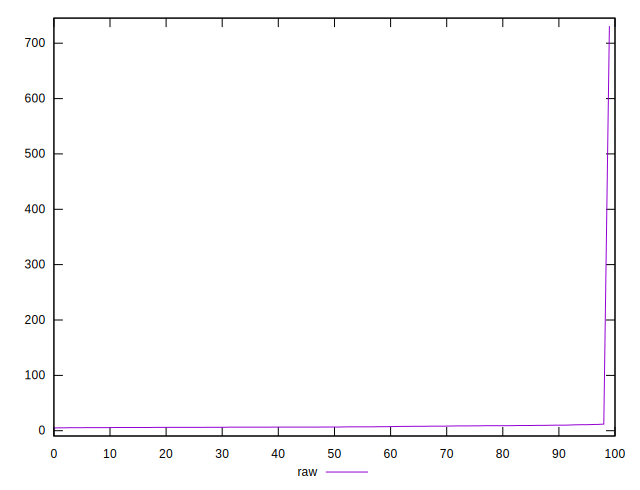

# //network-server-latency/samples/pages+cached

[→ Parent](../..)


## Raw


```yaml
p90min: 4.9603
p90max: 9.879499999999998
p90range: 4.919199999999998
p90mean: 7.026760929193007
p90median: 6.49145
p90stdev: 1.312577363941349
p90skewness: 0.6425109110838401
p90eccentricity: 0.9999999999999997
p90discretization: 1
outlandishness: 4.318786907619917

```

