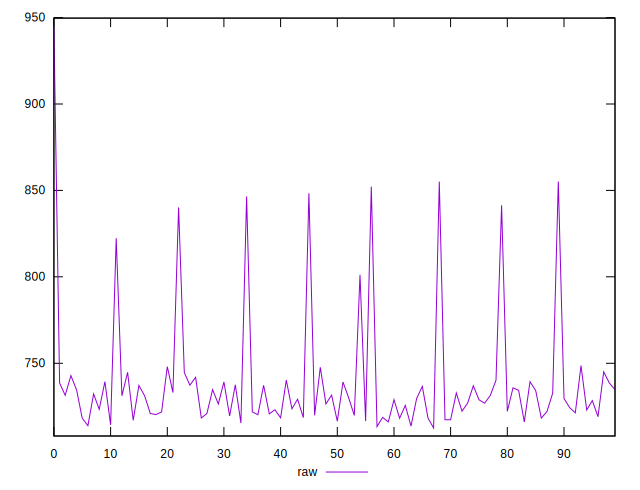
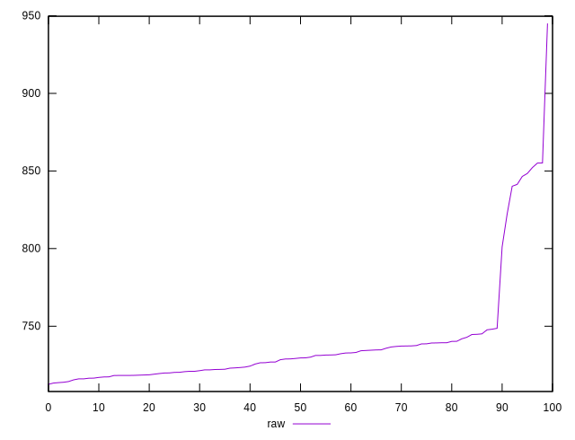

# //network-server-latency/samples/pages

[→ Parent](../..)


## Raw


```yaml
p90min: 712.569
p90max: 748.6340000000001
p90range: 36.06500000000017
p90mean: 727.9120222222222
p90median: 726.8975
p90stdev: 9.535580224702032
p90skewness: 0.32238198448573063
p90eccentricity: 1.0000000000000002
p90discretization: 1
outlandishness: 1.0340321460266357

```

