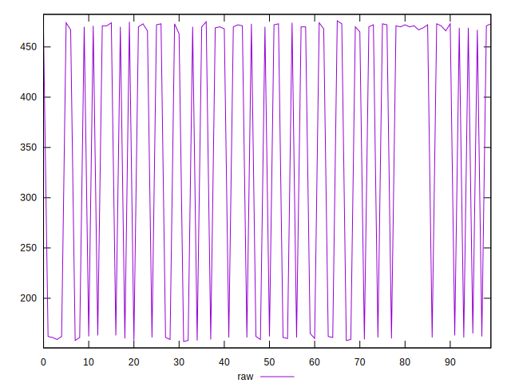
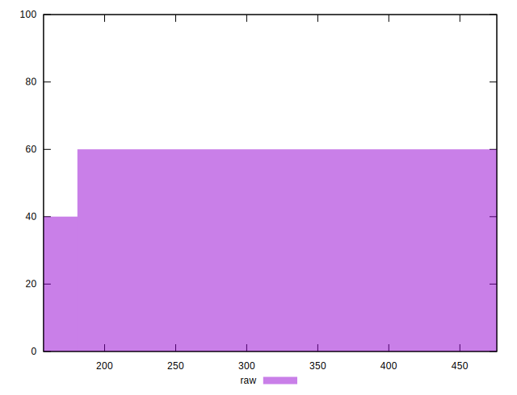
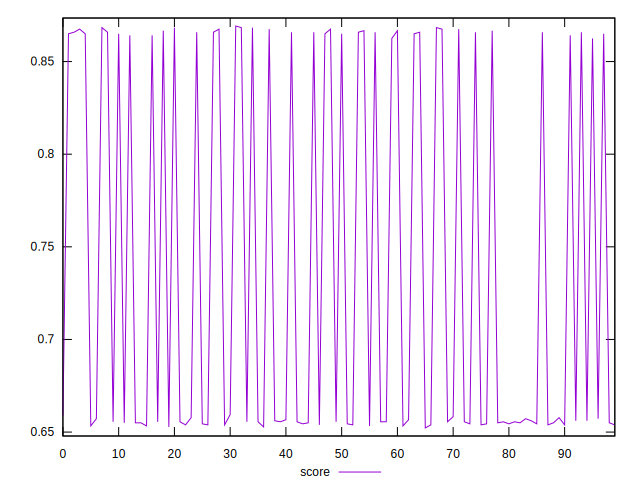
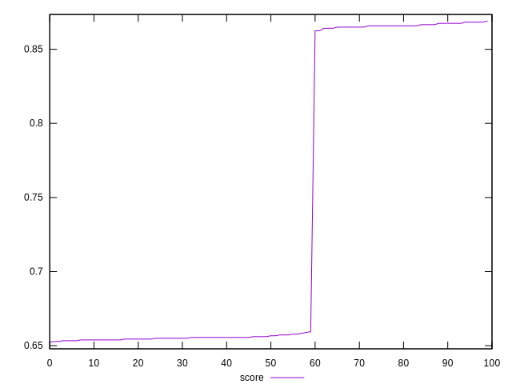
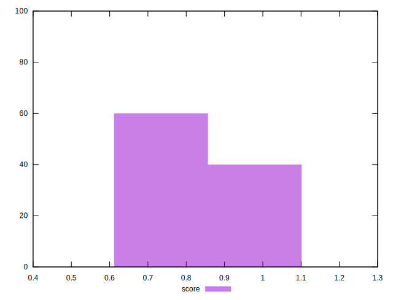

# //render-blocking-resources/samples/pages+cached+noadtech

[→ Parent](../..)


## Raw


```yaml
p90min: 159
p90max: 476
p90range: 317
p90mean: 365.3076923076923
p90median: 470
p90stdev: 146.61879197636512
p90skewness: -0.671831900797646
p90eccentricity: 0.9999999999999997
p90discretization: 4.55
outlandishness: 0.9005646310262656

```


## Score


```yaml
p90min: 0.6522222222222223
p90max: 0.8674999999999999
p90range: 0.21527777777777768
p90mean: 0.7268376068376069
p90median: 0.6555555555555556
p90stdev: 0.09970663767222714
p90skewness: 0.6721125368733182
p90eccentricity: 0.9999999999999993
p90discretization: 4.55
outlandishness: 1.0353014640224643

```


## P Score


```yaml
p90min: 0.6522222222222223
p90max: 0.8674999999999999
p90range: 0.21527777777777768
p90mean: 0.7268376068376069
p90median: 0.6555555555555556
p90stdev: 0.09970663767222714
p90skewness: 0.6721125368733182
p90eccentricity: 0.9999999999999993
p90discretization: 4.55
outlandishness: 1.0353014640224643

```


## Score Difference


```yaml
p90min: -0.004166666666666652
p90max: 0.0050000000000000044
p90range: 0.009166666666666656
p90mean: 0.00213064713064715
p90median: 0.0033333333333334103
p90stdev: 0.003161005088513588
p90skewness: -1.0251117516903172
p90eccentricity: 0.9999999999999991
p90discretization: 4.7894736842105265
outlandishness: 0.5254380538747696

```


## P Score Difference


```yaml
p90min: 0
p90max: 0
p90range: 0
p90mean: 0
p90median: 0
p90stdev: 0
p90skewness: .nan
p90eccentricity: .nan
p90discretization: 91
outlandishness: .nan

```

