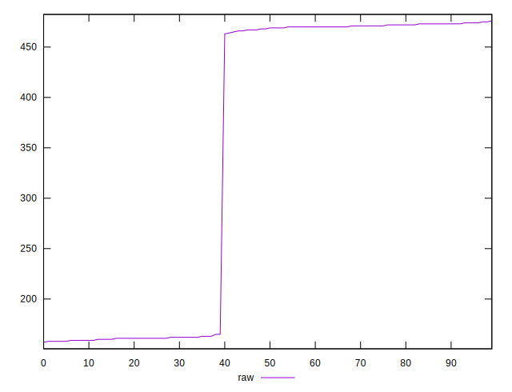
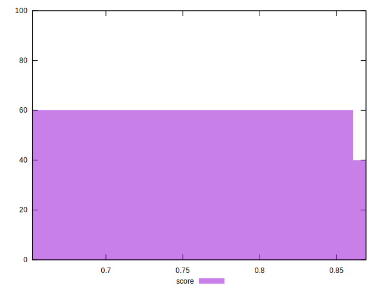

# //render-blocking-resources/samples/pages+cached+noadtech

[→ Parent](../..)


## Raw


```yaml
p90min: 157
p90max: 473
p90range: 316
p90mean: 332.5111111111111
p90median: 466.5
p90stdev: 153.73225241340475
p90skewness: -0.2234030319614633
p90eccentricity: 0.9999999999999986
p90discretization: 4.7368421052631575
outlandishness: 1.086976604366111

```


## Score


```yaml
p90min: 0.6522222222222223
p90max: 0.8674999999999999
p90range: 0.21527777777777768
p90mean: 0.7252746913580251
p90median: 0.6555555555555556
p90stdev: 0.09914427674102758
p90skewness: 0.7067749337804664
p90eccentricity: 0.9999999999999984
p90discretization: 4.5
outlandishness: 1.0397682740093184

```

