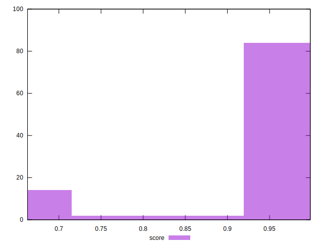

# //render-blocking-resources/samples/pages+cached+noexternal+nofonts+nosvg+noimg

[→ Parent](../..)


## Raw


```yaml
p90min: 2
p90max: 455
p90range: 453
p90mean: 36.97802197802198
p90median: 6
p90stdev: 110.25654180805805
p90skewness: 3.3085758983487543
p90eccentricity: 0.9999999999999984
p90discretization: 9.1
outlandishness: 4.079787719850131

```


## Score


```yaml
p90min: 0.6638888888888889
p90max: 0.9983333333333333
p90range: 0.33444444444444443
p90mean: 0.9716147741147748
p90median: 0.995
p90stdev: 0.08282963270068551
p90skewness: -3.25075285997981
p90eccentricity: 1.0000000000000002
p90discretization: 9.1
outlandishness: 0.9437036487388023

```

