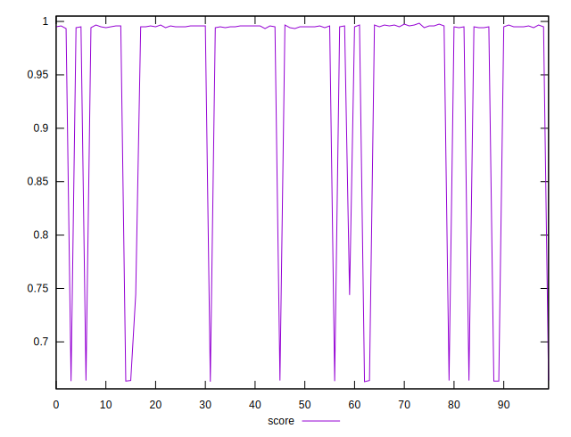
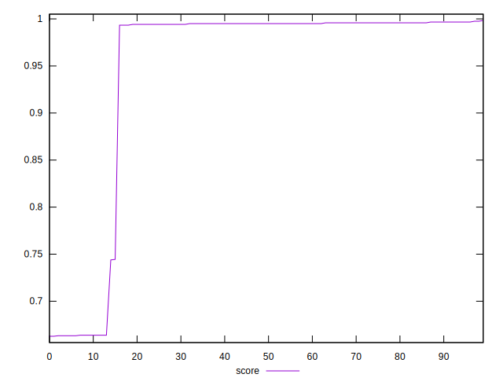

# //render-blocking-resources/samples/pages+cached+noexternal+nofonts+nosvg+noimg

[→ Parent](../..)


## Raw


```yaml
p90min: 2
p90max: 455
p90range: 453
p90mean: 32.333333333333336
p90median: 6
p90stdev: 101.62884542403421
p90skewness: 3.6356948803920686
p90eccentricity: 0.9999999999999984
p90discretization: 9
outlandishness: 5.336099999999998

```


## Score


```yaml
p90min: 0.6627777777777778
p90max: 0.9966666666666667
p90range: 0.3338888888888889
p90mean: 0.9379660493827159
p90median: 0.995
p90stdev: 0.12343769794502563
p90skewness: -1.7137892940959663
p90eccentricity: 0.9999999999999973
p90discretization: 9
outlandishness: 1.0126272641448857

```

