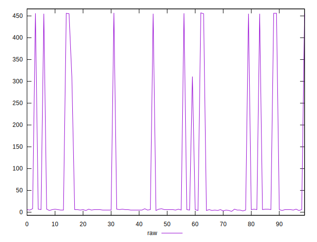
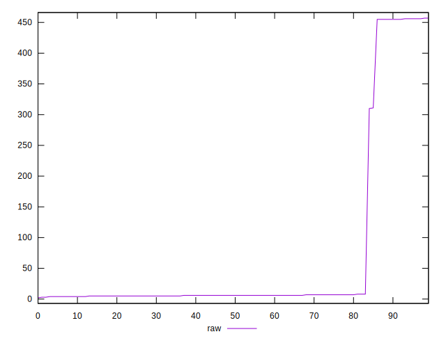

# //render-blocking-resources/samples/pages+cached+noexternal+nofonts+nosvg+noimg

[→ Parent](../..)


## Raw


```yaml
p90min: 2
p90max: 455
p90range: 453
p90mean: 36.97802197802198
p90median: 6
p90stdev: 110.25654180805807
p90skewness: 3.3085758983487508
p90eccentricity: 0.9999999999999986
p90discretization: 9.1
outlandishness: 4.079787719850131

```


## Score


```yaml
p90min: 0.6638888888888889
p90max: 0.9983333333333333
p90range: 0.33444444444444443
p90mean: 0.9716147741147748
p90median: 0.995
p90stdev: 0.0828296327006855
p90skewness: -3.2507528599798143
p90eccentricity: 1.0000000000000004
p90discretization: 9.1
outlandishness: 0.9437036487388023

```


## P Score


```yaml
p90min: 0.6638888888888889
p90max: 0.9983333333333333
p90range: 0.33444444444444443
p90mean: 0.9716147741147748
p90median: 0.995
p90stdev: 0.0828296327006855
p90skewness: -3.2507528599798143
p90eccentricity: 1.0000000000000004
p90discretization: 9.1
outlandishness: 0.9437036487388023

```


## Score Difference


```yaml
p90min: -0.004166666666666652
p90max: 0.0050000000000000044
p90range: 0.009166666666666656
p90mean: 0.002316849816849818
p90median: 0.004166666666666652
p90stdev: 0.003542055936427723
p90skewness: -1.0438154443547547
p90eccentricity: 0.9999999999999978
p90discretization: 9.1
outlandishness: 0.5579243628934132

```


## P Score Difference


```yaml
p90min: 0
p90max: 0
p90range: 0
p90mean: 0
p90median: 0
p90stdev: 0
p90skewness: .nan
p90eccentricity: .nan
p90discretization: 91
outlandishness: .nan

```

