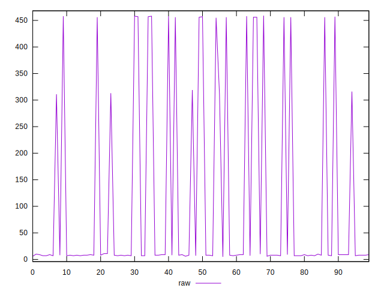

# //render-blocking-resources/samples/pages+cached+noexternal+nofonts

[→ Parent](../..)


## Raw


```yaml
p90min: 5
p90max: 457
p90range: 452
p90mean: 78.91208791208791
p90median: 8
p90stdev: 156.13699594341512
p90skewness: 1.8129597353490987
p90eccentricity: 1.0000000000000002
p90discretization: 6.5
outlandishness: 2.050910370114191

```


## Score


```yaml
p90min: 0.6627777777777778
p90max: 0.9958333333333333
p90range: 0.33305555555555555
p90mean: 0.9396916971916979
p90median: 0.9933333333333333
p90stdev: 0.11726814869865049
p90skewness: -1.76530331557611
p90eccentricity: 1.0000000000000009
p90discretization: 6.5
outlandishness: 0.9475793628234798

```


## P Score


```yaml
p90min: 0.6627777777777778
p90max: 0.9958333333333333
p90range: 0.33305555555555555
p90mean: 0.9396916971916979
p90median: 0.9933333333333333
p90stdev: 0.11726814869865049
p90skewness: -1.76530331557611
p90eccentricity: 1.0000000000000009
p90discretization: 6.5
outlandishness: 0.9475793628234798

```


## Score Difference


```yaml
p90min: -0.004166666666666652
p90max: -0.0016666666666665941
p90range: 0.0025000000000000577
p90mean: -0.003250915750915744
p90median: -0.0033333333333332993
p90stdev: 0.0007018765975572189
p90skewness: 0.3347910410091263
p90eccentricity: 1.0000000000000009
p90discretization: 10.11111111111111
outlandishness: 0.7581094968811308

```


## P Score Difference


```yaml
p90min: 0
p90max: 0
p90range: 0
p90mean: 0
p90median: 0
p90stdev: 0
p90skewness: .nan
p90eccentricity: .nan
p90discretization: 91
outlandishness: .nan

```

