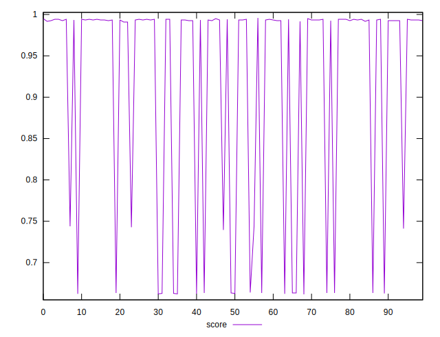
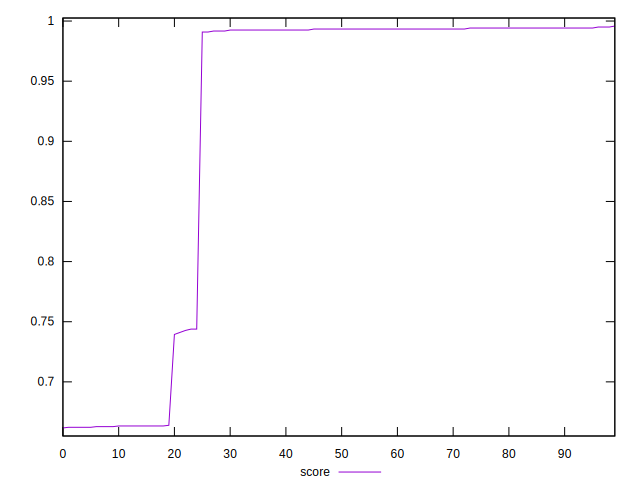

# //render-blocking-resources/samples/pages+cached+noexternal+nofonts

[→ Parent](../..)


## Raw


```yaml
p90min: 5
p90max: 456
p90range: 451
p90mean: 74.71111111111111
p90median: 8
p90stdev: 151.80135004848665
p90skewness: 1.9060680041303852
p90eccentricity: 1.000000000000001
p90discretization: 6.923076923076923
outlandishness: 2.288038664849929

```


## Score


```yaml
p90min: 0.6616666666666666
p90max: 0.9941666666666666
p90range: 0.3325
p90mean: 0.9058580246913588
p90median: 0.9929166666666667
p90stdev: 0.14183501038964197
p90skewness: -1.033731617275151
p90eccentricity: 1.0000000000000029
p90discretization: 6.428571428571429
outlandishness: 1.0196851650797958

```

