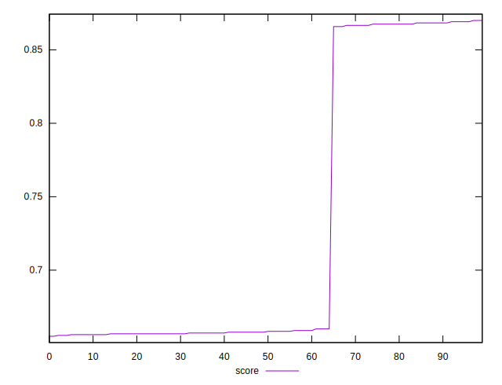

# //render-blocking-resources/samples/pages+cached+noexternal+noimg

[→ Parent](../..)


## Raw


```yaml
p90min: 156
p90max: 469
p90range: 313
p90mean: 346.72222222222223
p90median: 465
p90stdev: 150.10211544721284
p90skewness: -0.45564753468557484
p90eccentricity: 1.0000000000000002
p90discretization: 6.923076923076923
outlandishness: 1.0721953766822718

```


## Score


```yaml
p90min: 0.655
p90max: 0.8683333333333333
p90range: 0.21333333333333326
p90mean: 0.7155956790123454
p90median: 0.6577777777777778
p90stdev: 0.09408925184786326
p90skewness: 0.9919671572749221
p90eccentricity: 1.0000000000000018
p90discretization: 6.923076923076923
outlandishness: 1.0434055083591802

```

