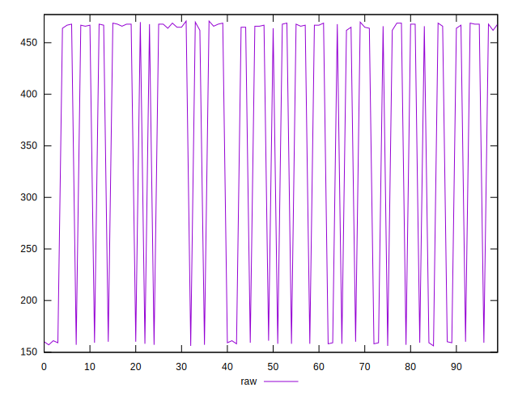
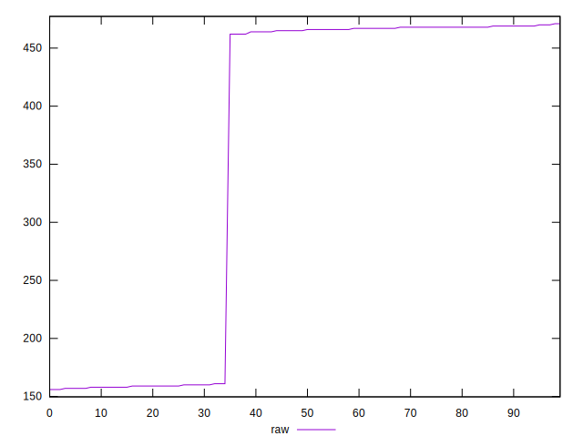

# //render-blocking-resources/samples/pages+cached+noexternal+noimg

[→ Parent](../..)


## Raw


```yaml
p90min: 158
p90max: 471
p90range: 313
p90mean: 379.02197802197804
p90median: 466
p90stdev: 139.0449352636084
p90skewness: -0.9481811657384274
p90eccentricity: 1.0000000000000009
p90discretization: 7
outlandishness: 0.8972397333924959

```


## Score


```yaml
p90min: 0.655
p90max: 0.8683333333333333
p90range: 0.21333333333333326
p90mean: 0.7172741147741147
p90median: 0.6577777777777778
p90stdev: 0.09491600039401268
p90skewness: 0.9483880436620533
p90eccentricity: 0.9999999999999997
p90discretization: 7
outlandishness: 1.0385280422483603

```

