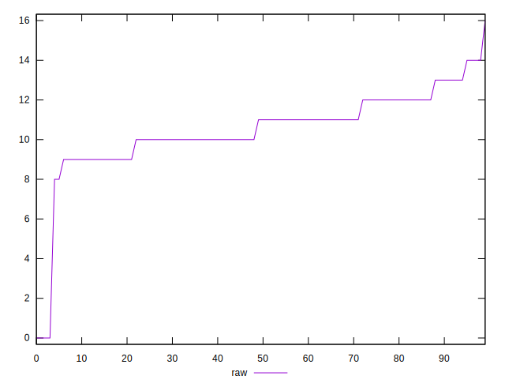

# //render-blocking-resources/samples/pages+cached+noexternal+nojs

[→ Parent](../..)


## Raw


```yaml
p90min: 8
p90max: 13
p90range: 5
p90mean: 10.615384615384615
p90median: 11
p90stdev: 1.2383011294656243
p90skewness: 0.16889475539316517
p90eccentricity: 1.0000000000000002
p90discretization: 15.166666666666666
outlandishness: 0.9561438563327034

```


## Score


```yaml
p90min: 0.9891666666666666
p90max: 0.9933333333333333
p90range: 0.004166666666666652
p90mean: 0.9911538461538455
p90median: 0.9908333333333333
p90stdev: 0.0010319176078880392
p90skewness: -0.16889475539026866
p90eccentricity: 1
p90discretization: 15.166666666666666
outlandishness: 1.0003958482465325

```

