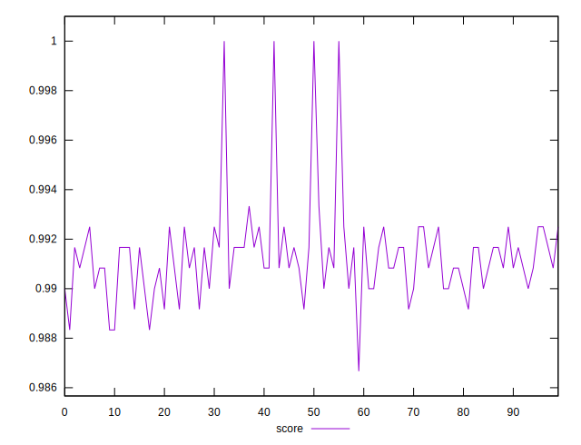

# //render-blocking-resources/samples/pages+cached+noexternal+nojs

[→ Parent](../..)


## Raw


```yaml
p90min: 0
p90max: 13
p90range: 13
p90mean: 10.011111111111111
p90median: 10
p90stdev: 2.424387411489272
p90skewness: -2.997825357322331
p90eccentricity: 0.9999999999999962
p90discretization: 12.857142857142858
outlandishness: 1.0750536646296323

```


## Score


```yaml
p90min: 0.9866666666666667
p90max: 0.9925
p90range: 0.005833333333333357
p90mean: 0.9908703703703705
p90median: 0.9908333333333333
p90stdev: 0.0011779291773177454
p90skewness: -0.8103826197531216
p90eccentricity: 0.9999999999999978
p90discretization: 12.857142857142858
outlandishness: 1.0009683319353395

```

