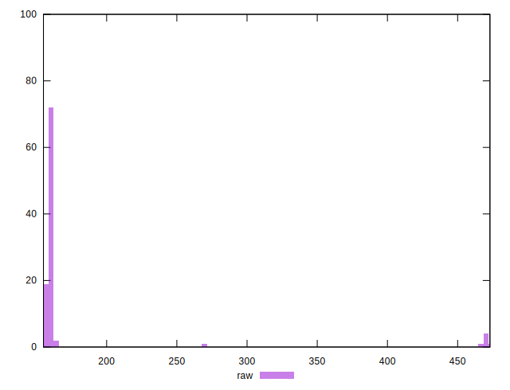
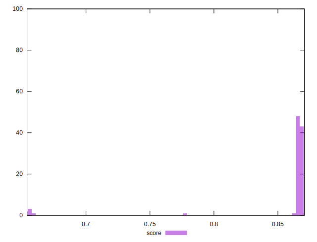

# //render-blocking-resources/samples/pages+cached+noexternal+nosvg

[→ Parent](../..)


## Raw


```yaml
p90min: 155
p90max: 162
p90range: 7
p90mean: 159.55555555555554
p90median: 160
p90stdev: 1.4840718095168008
p90skewness: -0.5568178996348104
p90eccentricity: 0.9999999999999999
p90discretization: 11.25
outlandishness: 1.2635106331131047

```


## Score


```yaml
p90min: 0.6538888888888889
p90max: 0.8683333333333333
p90range: 0.21444444444444444
p90mean: 0.851595679012347
p90median: 0.8666666666666667
p90stdev: 0.0531979789805181
p90skewness: -3.337137737634291
p90eccentricity: 0.9999999999999989
p90discretization: 6.923076923076923
outlandishness: 1.00417008385481

```

