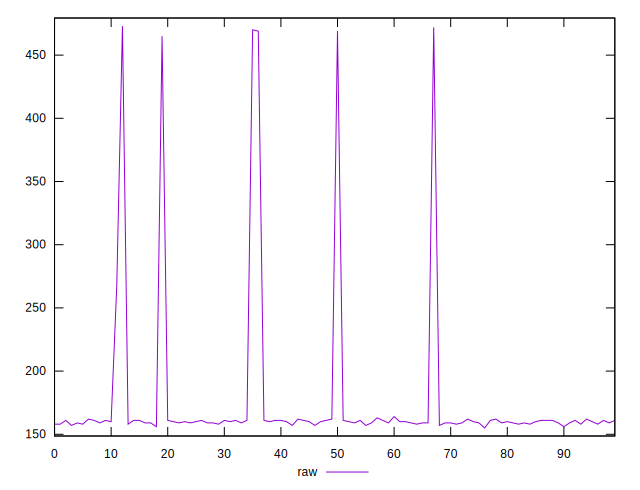
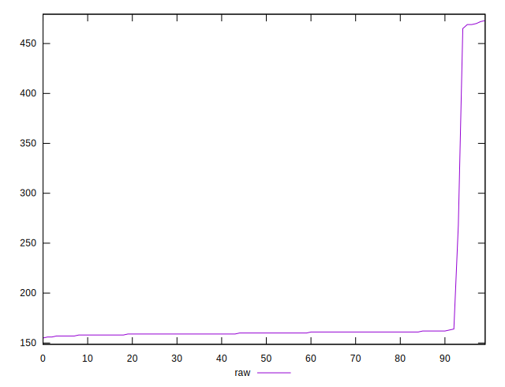
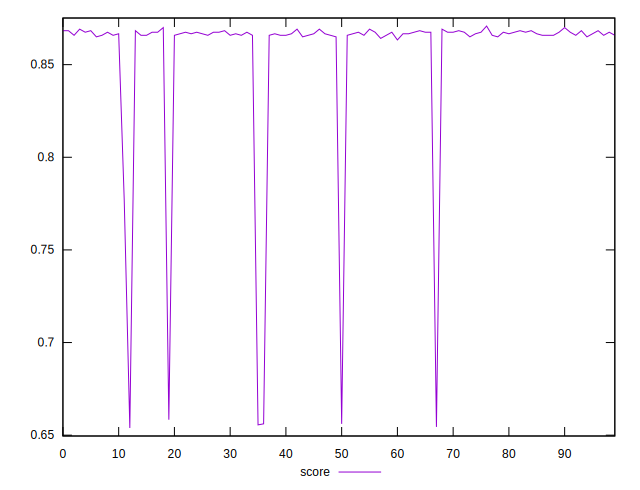

# //render-blocking-resources/samples/pages+cached+noexternal+nosvg

[→ Parent](../..)


## Raw


```yaml
p90min: 156
p90max: 164
p90range: 8
p90mean: 159.75824175824175
p90median: 160
p90stdev: 1.4776031924370638
p90skewness: -0.008909653471300684
p90eccentricity: 1.0000000000000018
p90discretization: 10.11111111111111
outlandishness: 1.2603066204234648

```


## Score


```yaml
p90min: 0.8633333333333333
p90max: 0.87
p90range: 0.00666666666666671
p90mean: 0.866868131868132
p90median: 0.8666666666666667
p90stdev: 0.0012313359936975367
p90skewness: 0.008909653470811525
p90eccentricity: 0.9999999999999984
p90discretization: 10.11111111111111
outlandishness: 0.9690989031045802

```

