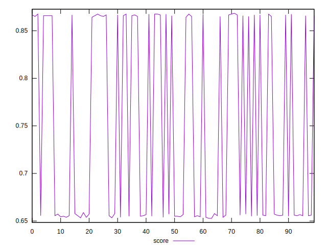
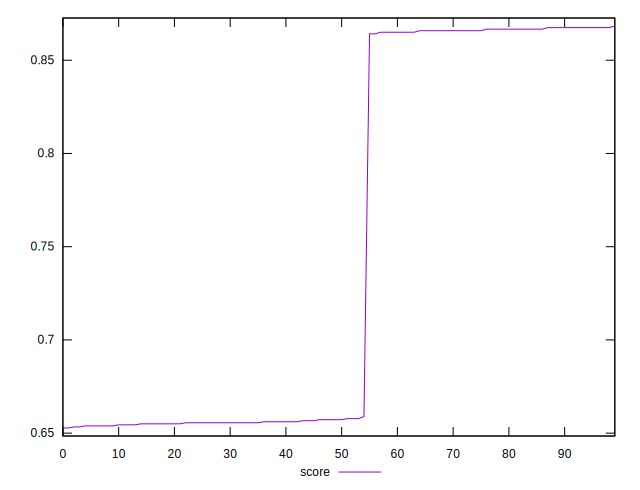

# //render-blocking-resources/samples/pages+cached+noexternal

[→ Parent](../..)


## Raw


```yaml
p90min: 159
p90max: 475
p90range: 316
p90mean: 347.7362637362637
p90median: 468
p90stdev: 151.2694877221135
p90skewness: -0.42660003146504194
p90eccentricity: 1.0000000000000004
p90discretization: 5.6875
outlandishness: 0.9046351888406771

```


## Score


```yaml
p90min: 0.6527777777777778
p90max: 0.8674999999999999
p90range: 0.21472222222222215
p90mean: 0.7387789987789989
p90median: 0.6566666666666666
p90stdev: 0.1029483938358484
p90skewness: 0.4267805035484128
p90eccentricity: 0.9999999999999997
p90discretization: 5.6875
outlandishness: 1.0316310730926685

```

